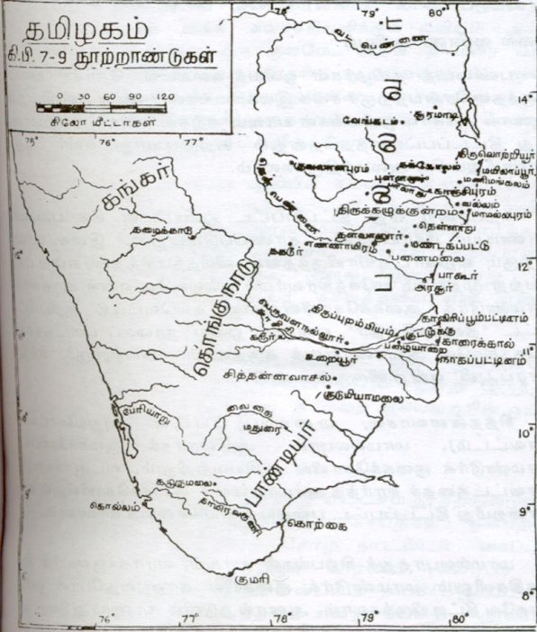

இந்தியாவிலேயே மிகச் சிறந்த நகரங்களாக விளங்கியவை ஏழு என்பர்.
அவற்றுள் சிறந்தோங்கி வருவது காஞ்சிபுரமாகும். பண்டைய புகழினும், கல்வி,
கலை, சமய தத்துவங்கள், நாகரிகங்கள் ஆகியவற்றின் வளர்ச்சியிலும்
மேம்பட்டு விளங்குவது இந் நகரம். இங்குக் காணப்படும் நூற்றுக்கணக்கான
கோயில்களும், குளங்களும் மறைந்துபோன பேரரசுகளையும், பேரரசர்களையும்
நினைவூட்டுகின்றன. காஞ்சிமாநகரம் ஏறக்குறைய ஆறு நூற்றாண்டுக் காலம்,
கி.பி. மூன்று முதல் ஒன்பதாம் நூற்றாண்டு வரையில், பல்லவரின் ஆட்சியில்
இருந்துவந்தது.

சென்ற ஐம்பது ஆண்டுகளாகவே பல்லவர்கள், யார், எங்கிருந்து
வந்தவர்கள் என்னும் ஆய்வு வரலாற்று ஆராய்ச்சியாளரால்
மேற்கொள்ளப்பட்டு வந்துள்ளது. எனினும், அவர்களுக்குள் உடம்பாடான
முடிவு ஒன்றும் ஏற்படவில்லை. பல்லவர்கள் ஆதியில் வாழ்ந்த இடம்
இன்னதென்பதும், தமிழகத்துக்கு எப்படி வந்தனர் என்பதும் இன்னும்
மறைபொருளாகவே இருந்துவருகின்றன. சங்க இலக்கியத்தில் பல்லவரைப்
பற்றிய குறிப்பு ஒன்றும் காணப்படவில்லை. ஆனால், பல்லவர்கள் எழுதி
வைத்துச் சென்ற கல்வெட்டுகள், எழுதிக் கொடுத்துள்ள செப்பேடுகள்
ஆகியவற்றைக்கொண்டு அவர்களைப் பற்றிய வரலாற்றை ஒருவாறு கோவை
செய்துகொள்ளலாம். பல்லவர்களுடைய கல்வெட்டுகள் மகேந்திரவாடி,
தளவானூர், பல்லாவரம், திருச்சிராப்பள்ளி, திருக்கழுக்குன்றம், வல்லம்,
மாமண்டூர், மண்டகப்பட்டு, சித்தன்னவாசல், மாமல்லபுரம் ஆகிய இடங்களில்
கண்டெடுக்கப்பட்டுள்ளன. பல்லவர்கள் முதன்முதல் பிராகிருத மொழியில்
சாசனங்களைப் பொறித்து வந்தனர் (கி. பி. 250-350). பிறகு சமஸ்கிருத
மொழியில் செப்பேடுகளையும் கல்வெட்டுகளையும் பொறிக்கும் வழக்கத்தை
மேற்கொண்டனர். கி. பி. 7ஆம் நூற்றாண்டில் கிரந்த-தமிழ் எழுத்தில்
எழுதப்பட்டன.

பல்லவரின் அரசியல் முறைகள் ஆதியில் சாதவாகனரின் அரசியல்
முறைகளுடனும், கௌடிலியரின் அர்த்தசாத்திரக்கோட்பாடுகளுடனும் மிக நெருங்கிய தொடர்பு கொண்டிருந்தது.
பல்லவருடைய பண்பாடுகள் பலவும் தமிழ் மன்னருடைய பண்பாடுகட்கு
முற்றிலும் முரண்பாடாகக் காணப்பட்டன. அவர்கள் வடமொழியையே போற்றி
வளர்த்தனர். இக் காரணங்களைக் கொண்டு பல்லவர் பரம்பரையின்
தொடக்கம் தமிழகத்துக்குப் புறம்பாக ஏற்பட்டிருக்கவேண்டும் என்று
ஆய்வாளர் சிலர் கருதுகின்றனர். சாதவாகனரின் ஆட்சி குன்றிவரும்போது
பல்லவர்கள் தொண்டை மண்டலத்தைக் கைப்பற்றினார்கள் என்றும், அதற்கு
முன்பு அவர்கள் சாகர்களுடன் இணைந்திருந்து மேற்கிந்தியப் பகுதிகளிலும்,
சிந்து வெளியிலும், ‘பஹ்லவர்’ அல்லது ‘பார்த்தியர்’ என்ற பெயரில் குடியேறி
வாழ்ந்து வந்தார்கள் என்றும் ஒரு கருத்து நிலவுகின்றது. அப்படியாயின்
அவர்கள் காஞ்சிபுரத்துக்கு ஏன் வந்தார்கள் என்னும் கேள்விக்கு விளக்கங்
கிடைக்கவில்லை. பல்லவர்களுடைய கல்வெட்டுகளிலும், செப்பேடுகளிலும்
பஹ்லவர் என்னும் சொல்லே வழங்கப்படவில்லை. பல்லவர்கள் அசுவமேத
யாகம் வேட்பது வழக்கமாகக் கொண்டிருந்தனர். ஆனால், பஹ்லவர்களிடம்
இவ்வழக்கம் காணப்படவில்லை. அவர்கள் அந்நியப் பண்பாட்டினர்.
காஞ்சிபுரம் வைகுண்டப் பெருமாள் கோயிலில் யானையின் மத்தகத்தைப்
போன்று வடிவமைக்கப்பட்ட உருவம் ஒன்று மணிமுடி சூடிய கோலத்தில்
தீட்டப்பட்டுள்ளது. இதைக் கொண்டு பல்லவர்கள் பார்த்தியர்களைச்
சேர்ந்தவர்கள் எனவுங் கூறுவர். ஏனெனில், இந்தோ பாக்டிரிய மன்னனான
டெமிட்டிரியஸ் என்பான் ஒருவனுடைய உருவம் அவனுடைய நாணயம்
ஒன்றின்மேல் இத்தகைய முடியுடன் காட்சியளிக்கின்றது. இச் சான்று
ஒன்றைமட்டுங் கொண்டு பல்லவர்கள் பார்த்தியர்களைச் சேர்ந்தவர்கள்
என்று கொள்வது பொருந்தாது.

பல்லவர்கள் வாகாடகர்களுள் ஒரு பிரிவினர் என்றும்,
வாகாடகர்களைப் போலவே பல்லவர்களும் தம்மைப் பார்த்து வாசக்
கோத்திரத்தினராக கூறிக்கொள்கின்றனர் என்றும், இவர்கள் இரு
பிரிவினருமே பிராமணக் குலத்தினர் என்றும், பல்லவரைச் சார்ந்த வீரகூர்ச்சா
என்பான் ஒருவன் நாக கன்னிகை ஒருத்தியை மணந்தான் என்றும் கூறுவர்.
சோழன் வெள்வேற் கிள்ளிக்கும் பீலிவளை என்ற நாக கன்னிகைக்கும்
தொண்டைமான் இளந்திரையன் பிறந்தான். அவனுடைய பெயரினால்
தொண்டைமண்டலம் தோற்றுவிக்கப்பட்டது. இவ் வரலாற்றை மணிமேகலை
தருகின்றது. இதனுடன் கூர்ச்சா என்பவன் நாககன்னிகைகைய மணந்த செய்தி
முரண்படுகின்றது.

தளவானூர்க் குகைக் கல்வெட்டுகளில் மகேந்திரவர்ம பல்லவனே ‘தொண்டை’
மாலை யணிந்தவன் எனக் குறிப்பிடப்படுகின்றான். பல்லவர்கள்
சாதவாகனரின்கீழ்க் குறுநில மன்னராகவும், ஆட்சி அலுவலராகவும்
செயற்பட்டு வந்தனர் என்றும், ‘பல்லவர்’ என்னும் சொல்லும் தொண்டையர்
என்னும் சொல்லும் ஒரு பொருளையே குறிக்குமென்றும், சாதவாகனப் பேரரசு
வீழ்ச்சியுற்ற பிறகு இப் பல்லவர்கள் காஞ்சிபுரத்தில் தம் பெயரில் ஆட்சிப்
பரம்பரை யொன்றைத் தொடங்கினர் என்றும், அதன் பின்னர்த்
தொண்டையர் என்னும் பெயர் மறைந்து பல்லவர் என்னும் பெயருக்கு
இடங்கொடுத்தது என்றும் டாக்டர் எஸ்.கிருஷ்ணசாமி அய்யங்கார் கருதுவார்.

பல்லவர்கள் தொண்டை மண்டலத்திலேயே தோன்றியவர்கள் என்னும்
கொள்கைக்கும் போதிய சான்றுகள் எடுத்துக் காட்டப்படுகின்றன. மோரிய
மன்னன் அசோகனின் குடிமக்களுள் புலிந்தர் என்றோர் இனத்தவரும்
இருந்தனரென அப்பேரரசனின் கல்வெட்டுகள் தெரிவிக்கின்றன. அக்காலத்தில்
தொண்டை மண்டலத்தில் குறும்பர் என்ற ஓரினத்தினர் வாழ்ந்து வந்தனர்.
இவர்களே அப் புலிந்தர்கள் போலும். தொண்டை மண்டலத்தில் இரு பெரும்
கோட்டங்களில் ஒன்றுக்குப் புலி நாடு என்றும் மற்றொன்றுக்குப் புலியூர்க்
கோட்டம் என்றும் பெயர் வழங்கிற்று. வயலூர் என்ற இடத்தில்
இராசசிம்மனின் தூண் கல்வெட்டு ஒன்று கிடைத்துள்ளது. அக் கல்வெட்டில்
அசோகனின் முன் பரம்பரையைக் கூறிவரும்போதும் அசுவத்தாமாவின்
பெயரையடுத்தும், அசோகன் பெயருக்கு முன்பும் ‘பல்லவன்’ என்னும் ஒரு
பெயர் காணப்படுகின்றது. எனவே, அசோகனுக்கு முன்னே பல்லவப் பரம்பரை
இருந்ததாக ஊகிக்க இடமுள்ளது. அசோகனின் கல்வெட்டுகள் சிலவற்றுள்
புலிந்தர்கள் ‘பலடர்’ என்றும் குறிப்பிடப்பட்டுள்ளனர். பலடர் என்னும் சொல்
காலப் போக்கில் பல்லவர் என்றும் மாறியிருக்கக் கூடும் என்றும் சிலர்
எண்ணுகின்றனர். தொண்டை மண்டலம் கி.மு. இரண்டாம் நூற்றாண்டிலிருந்து
கி.பி. முதல் நூற்றாண்டு வரையில் மிகவும் புகழ்பெற்று விளங்கியதற்கு
மணிமேகலை சான்று பகர்கின்றது. கரிகால் சோழன் கி.பி. இரண்டாம்
நூற்றாண்டில் பாலாற்றுக்குத் தென்புறத்திலிருந்த தொண்டை மண்டலப்
பகுதியை வென்று சோழ நாட்டுடன் இணைத்துக் கொண்டான். அப்போது
காஞ்சிபுரத்தில் வழங்கிவந்த மோரிய நிறுவனங்களை அவன் அழித்திருக்க
முடியாது. ஏனெனில், பல்லவர்கள் சாதவாகனருக்குத் திறை செலுத்தி வந்தனர்.
ஆகையால், சாதவாகனருடைய பாதுகாப்பு காஞ்சிபுரத்துக்கு
அரண் செய்தது. சாதவாகனரின் ஆட்சி கி.பி. 225-ல் வீழ்ச்சியுற்றது.
அவர்களுக்குப் பின்னர்க் காஞ்சிபுரத்தில் பல்லவரே முழு ஆட்சிப்
பொறுப்பையும் ஏற்றுக்கொண்டனர். நாளடைவில் அவர்களுடைய
ஆட்சியானது காஞ்சிபுரத்திலிருந்து வடக்கில் கிருஷ்ணா நதிவரையில்
பரவிற்று. மயிதவொளு, ஹீரஹதஹள்ளி என்னும் ஊர்களில் கிடைத்துள்ள
சிவஸ்கந்த வர்மனின் பிராகிருத மொழிச் செப்பேடுகளில் இதற்குச் சான்றுகள்
காணப்படுகின்றன. சாதவாகனருடன் தொடர்பு கொண்டிருந்த காரணத்தால்
பல்லவர்கள் பிராகிருத மொழியிலும், சமஸ்கிருத மொழியிலும் பயிற்சி
மிக்கவர்களாக இருந்தனர்; அம் மொழிகளிலேயே சாசனங்களையும் பொறித்து
வைத்தனர். ஆகவே, பல்லவர்கள் சாதவாகனரின் குலத்தைச் சார்ந்தவர்கள்
என ஊகிக்கவும் இடமுண்டு.

சிவஸ்கந்தவர்மன் கி.பி. நான்காம் நூற்றாண்டின் தொடக்கத்தில்
காஞ்சிபுரத்தினின்றும் அரசாண்டான். அப்போது அவனுடைய அரசு வடக்கே
கிருஷ்ணா நதியிலிருந்து தெற்கில் தென்பெண்ணை வரையில் பரவியிருந்தது.
அவன் காலத்திய சாசனங்கள் பிராகிருத மொழியில் பொறிக்கப்பட்டன.

ஸ்கந்தவர்மன் வழிவந்தவன் விஷ்ணுகோபன். அவன் ஏறத்தாழக் கி.பி.
350-375 ஆண்டுகளில் ஆட்சி புரிந்தவன். சமுத்திரகுப்தன் என்ற மோரிய
மன்னனிடம் தோல்வியுண்ட பன்னிரண்டு தட்சிணாபத அரசருள்
விஷ்ணுகோபனும் ஒருவன்.

பல்லவ சமஸ்கிருதச் செப்பேடுகளில் பதினாறு மன்னரின் பெயர்கள்
காணப்படுகின்றன. அவர்கள் கி.பி. 330-575 கால அளவில் ஆண்டு
வந்தவர்கள். பல்லவ மன்னர் பரம்பரையில் முன்னே கூறப்பட்ட வீரகூர்ச்சா
என்பவனும், பிறகு ஸ்கந்தசிஷ்யனும் ஆண்ட காலத்தில் காஞ்சிபுரத்தில்
பிராமண கடிகைகள் நடைபெற்று வந்தன. அவை பிராமணருக்கு
வடமொழியையும், வேதங்களையும் பயிற்றிவந்தன. அவற்றின் நிருவாகத்தில்
ஏதோ ஒழுக்கக் கேடுகள் நேர்ந்தன போலும். அரசாங்க ஆணைகட்குக்
கட்டுப்படாமல் அவை எதிர்ப்புக் காட்டியிருக்க வேண்டும். அதனால்
ஸ்கந்தசிஷ்யன் படைவலிமையைக் கொண்டு அவற்றைக் கைப்பற்றினான்.

சமுத்திரகுப்தன் கைகளில் விஷ்ணுகோபன் தோல்வியுற்ற பிறகு
காஞ்சிபுரத்து அரசியலில் பெருங்குழப்பமும் சிக்கல்களும்
ஏற்பட்டன. குமாரவிஷ்ணு என்பவன் மிகவும் முயன்று காஞ்சிபுரத்தைக்
கைப்பற்றினான் என்று வேலூர்ப்பாளையம் செப்பேடுகள் தெரிவிக்கின்றன.
விஷ்ணுகோபனுக்கும் குமார விஷ்ணுவுக்கும் இடையிட்ட காலத்தில் நேர்ந்த
குழப்பங்கட்குக் காரணம் காஞ்சிபுரத்தின்மேல் சோழன் செங்கணான் படை
யெடுத்ததேயாகும்.

பல்லவர் பரம்பரையில் சிம்மவர்மன் என்பவன் சு. கி. பி. 436-ல்
அரசுகட்டில் ஏறினான். இவனுடைய ஆட்சிக்குப் பிறகு இரண்டாம்
சிம்மவர்மன் மணிமுடி தரித்துக் கொண்டான்.(கி.பி. 575). அவன் காலத்தில்,
தொடக்க முதல் இறுதிவரையில் நாட்டில் களப்பிரர் படையெடுப்பினால்
கலகமும் கிளர்ச்சியும் குழப்பமும் மேலிட்டன. அவன் மகன் சிம்மவிஷ்ணு
என்பவன் கி.பி. 6ஆம் நூற்றாண்டின் இறுதியில் அரசுரிமை ஏற்றான். பல்லவ
காலத்திய இலக்கிய வளர்ச்சியும், பண்பாட்டு மேம்பாடும், அரசியல் விரிவும்
சிம்மவிஷ்ணுவின் காலத்திலிருந்தே தொடங்குகின்றன. இவன் களப்பிரரையும்
சேர, சோழ, பாண்டிய மன்னரையும், மாளவரையும், சிங்களவரையும் வென்று
வாகை சூடினான் என்று காசக்குடிச் செப்பேடுகள் கூறுகின்றன. இவனுடைய
அரசாட்சியானது தெற்கில் கும்பகோணம் வரையில் விரிவுற்று நின்றது.
இவனுடைய அரசவைப் புலவரான பாரவி என்பார் ‘கிராதார்ச்சுனீயம்’
என்னும் வடமொழிக் காவியத்தை இயற்றினார். சிம்மவிஷ்ணுவின் உருவமும்,
இவருடைய பட்டத்தரசிகள் இருவரின் உருவமும் மாமல்லபுரத்தில்
புடைப்போவியங்களாகச் செதுக்கப்பட்டுள்ளன.

சிம்மவிஷ்ணுவுக்குப் பிறகு அவன் மகன் முதலாம் மகேந்திரவர்மன் (சு.
கி. பி. 600-630) பட்டத்துக்கு வந்தான். இவனுக்கு விசித்திரசித்தன் என்றொரு
விருது பெயருமுண்டு. பல்லவர் பரம்பரையிலேயே புகழ் ஏணியில் ஏறி நின்ற
முதல் மன்னவன் மகேந்திரன்தான். இவன் காலத்தில்தான் பல்லவ சளுக்கப்
போர்கள் தொடங்கலாயின. பல்லவர்களுக்கும் கடம்பர்களுக்கு மிடையே
நெருங்கிய நட்புறவு இருந்து வந்தது. சளுக்க மன்னனான இரண்டாம்
புலிகேசியின் முன்னோர்கள் கடம்பரை வென்று அடிபணிய வைத்தனர்.
அதனால் கடம்பரின் நண்பர்களான பல்லவர்களுக்கும் சளுக்கர்களுக்கும்
அடிக்கடி போரும் பூசலும் மூண்டு வந்தன. சளுக்கர்கள் வேங்கியைப் கைப்பற்றி
மகேந்திரன்மேல் வெற்றிகண்டனர். காஞ்சிபுரத்தை யடுத்துள்ள புள்ளலூர்
என்ற இடத்தில் மகேந்திரவர்மன் சளுக்கரை அழித்தான் என்று காசக்குடிச்
செப்பேடுகள் கூறுகின்றன. இவன் செந்தகாரி (கோயில் கட்டுபவன்),
மத்தவிலாசன் (இன்பம் விரும்புபவன்), சித்திரகாரப் புலி (ஓவியர்க்குப் புலி)
என்ற விருதுகள் சிலவற்றையும் மேற்கொண்டான்.

ஒரே பாறையில் குடைந்து கோயில்கள் அமைக்கும் சிற்ப மரபானது
தமிழகத்தில் முதன்முதல் மகேந்திரவர்மனாற்றான் தோற்றுவிக்கப் பெற்றது.
புதுச்சேரிக்கு அண்மையிலுள்ள மண்டகப்பட்டு, திருச்சிராப்பள்ளி, பல்லாவரம்,
செங்கற்பட்டுக்கு அண்மையிலுள்ள வல்லம், மாமண்டூர், தளவானூர்,
சீயமங்கலம், மகேந்திரவாடி ஆகிய இடங்களிலும் இவன் குகைக் கோயில்கள்
குடைந்துள்ளான். அக் கோயில்களில் அவன் பொறிப்பித்த கல்வெட்டுகளும்
காணப்படுகின்றன. ‘செங்கலின்றி, மரமின்றி, உலோகமின்றி, காரையின்றிப்
பிரம்மா, விஷ்ணு, சிவன் ஆகிய தெய்வங்களுக்கு விசித்திரசித்தன் இக்
கோயிலை ஆக்கினான்’ என்று இவனுடைய மண்டகப்பட்டுக் கல்வெட்டு
வியந்து கூறுகின்றது. மகேந்திரவர்மன் மகேந்திரவாடி ஏரியைக் கட்டி
உழவுக்கு உதவினான். சிற்பத்திலும் ஓவியத்திலும் மட்டுமன்றி இசையிலும்
இவ்வேந்தன் வல்லுநனாக இருந்தான். இவனுடைய இசைப் புலமைக்குக்
குடுமியாமலைக் கல்வெட்டுச் சான்று எனச் சிலர் கருதுகின்றனர். இக்
கல்வெட்டுச் சற்றுப் பிற்காலத்தைச் சார்ந்தது என வேறு சிலர் கூறுகின்றனர்.
இதுபற்றி இறுதியான முடிவுக்கு வரமுடியாது.

மகேந்திரவர்மன் ஆதியில் சமணனாக இருந்தான். திருநாவுக்கரசரிடம்
ஈடுபாடுகொண்டு பிறகு சைவ சமயத்தைத் தழுவினான். இவன் சிவலிங்க
வழிபாடு உடையவன் என்று திருச்சிராப்பள்ளிக் கல்வெட்டுக் கூறுகின்றது.
தான் சைவனான பிறகு பாடலிபுரத்தில் (திருப்பாதிரிப்புலியூரில்) இருந்த ஒரு
சமணப் பள்ளியை இடித்து நிரவினான்.

**முதலாம் நரசிம்மவர்மன் (சு. கி. பி. 630-668)**

மகேந்திரவர்மனுக்குப் பிறகு அவன் மகன் முதலாம் நரசிம்ம வர்மன்
அரியணையேறினான். போரிலும் புகழிலும், தன் தந்தையினும் நரசிம்மவர்மன்
மேம்பட்டு விளங்கினான். சளுக்கரின்மேல் அவன் பல வெற்றிகளைக்
கொண்டான். மணிமங்கலத்தில் ஒரு முறையும், வாதாபியில் இரு முறையும்
அவன் சளுக்க மன்னன் இரண்டாம் புலிகேசியின்மேல் போர்தொடுத்து மாபெரும் வெற்றி பெற்றான்.
இரண்டாம் வாதாபிப் போர் வரலாற்றுப் புகழ்பெற்றதாகும். அப்போரை
நடத்தி வெற்றிவாகை சூடி வந்த படைத் தலைமையர் பரஞ்சோதியே. பிறகு
சிறுத்தொண்டநாயனராகத் திருத்தொண்டத் தொகையில் இடம் பெற்றார்.
நரசிம்மவர்மன் இரண்டாம் வாதாபிப் போரில் அந் நகரைக் கைப்பற்றிய
பிறகு புலிகேசி நீண்ட நாள் உயிர் வாழவில்லை. அவன் காலமான பிறகு (கி.
பி. 642) சளுக்கர் நாட்டில் ஏற்பட்ட குழப்பத்தின் காரணமாக அந் நாட்டின்
தென்பகுதிகள் பதின்மூன்று ஆண்டுகள் பல்லவரின் ஆட்சியில் இருந்து
வந்தன. அக் கால அளவில் மூன்று அரசர்கள் சளுக்க அரியணைமேல்
அமர்ந்து ஆட்சி புரிந்து வந்தனர் என விக்கிரமாதித்தன் கல்வெட்டுகள்
கூறகின்றன. அம் மூவரும் பல்லவனுக்கு அடிபணிந்திருந்தனர் போலும்.
இரண்டாம் புலிகேசியினிடம் ஹர்ஷவர்த்தனன் தோல்வியுற்றுத் தன்
வீரத்துக்குக் களங்கம் கற்பித்துக் கொண்டான். அதே புலிகேசியை வென்று
வாகை சூடி முதலாம் நரசிம்மவர்மன் தன் தந்தைக்கு ஏற்பட்ட இழுக்குக்குக்
கழுவாய் கண்டான்; ‘வாதாபிகொண்டான்’ என்னும் ஒரு விருதையும்
பெருமையுடன் புனைந்து கொண்டான்.

முதலாம் நரசிம்மவர்மனிடம் மாபெரும் கடற்படை ஒன்று இருந்தது.
அதன் துணையைக்கொண்டு இருமுறை இலங்கையின்மேல் படை செலுத்திச்
சென்று வெற்றி கண்டான். அவன் தன் நண்பன் மானவர்மன் என்ற சிங்கள
மன்னனுக்கு இலங்கையின் அரசுரிமையை வழங்கினான். (கி. பி. 631)

இந் நரசிம்மவர்மன் சிவனிடத்தில் பெரிதும் ஈடுபாடுடையவன்.
மாமல்லபுரத்துச் சிற்பங்களைப் படைத்துத் தமிழகத்து வரலாற்றில் அழியாத
புகழிடத்தைப் பெற்றுக்கொண்டான் இம்மன்னன். இவன் காலத்தில் சீன
யாத்திரிகன் யுவான்-சுவாங் காஞ்சிபுரத்துக்கு வந்திருந்தான் (கி. பி. 640).
அவனுடைய குறிப்புகளிலிருந்து அவன் கண்ட தொண்டை மண்டலத்தைப்
பற்றிய செய்திகள் பல கிடைக்கின்றன. காஞ்சிபுரம் ஆறு மைல் சுற்றளவு
இருந்தது. அக் காலத்துத் தமிழகத்து நகரங்களுள் இது மாபெரும் நகரமாகக்
காட்சி அளித்தது. அந் நகரில் நூறு பௌத்தப் பள்ளிகள் நடைபெற்று
வந்தன. அங்குப் பதினாயிரம் பிக்குகள் தங்கி அறம் வளர்க்க வசதிகள்
அமைக்கப்பட்டிருந்தன. இப்பள்ளிகளில் பெரும்பாலன திகம்பரப் பிரிவைச்
சார்ந்தவை. தமிழகத்தில் கி.பி. ஏழாம் நூற்றாண்டில் பௌத்தத்துக்குச்
செல்வாக்குக் குன்றி வந்துவிட்டதெனினும் காஞ்சிபுரத்தில் அது
சீரும் சிறப்புடன் வளர்ந்து வந்தது. நாலந்தாப் பல்கலைக் கழக ஆசிரியர்
தருமபாலர் என்பார் காஞ்சிபுரத்திலிருந்து பயின்று சென்றவர்தாம். அக்
காலத்தில் தொண்டை மண்டலத்து மக்கள் கல்வியறிவுக்கும் சமய
வளர்ச்சிக்கும் அளித்திருந்த செல்வாக்கின் உயர்ச்சியை இதனால் நாம் நன்கு
அறிந்துகொள்ளுகின்றோம்.

முதலாம் நரசிம்மவர்மனுக்குப் பின்னர் அவன் மகன் இரண்டாம்
மகேந்திரவர்மன் பல்லவ அரசனாக முடிசூட்டிக் கொண்டான். இவன்
ஈராண்டுகளே அரசாண்டான் (சு. கி. பி. 668-670). அவன் வருணாசிரம
தருமத்தை நிலைநாட்டினான் எனவும், கடிகைகளை வளர்த்தான் எனவும்
கல்வெட்டுச் செய்திகள் தெரிவிக்கின்றன. அவன் சளுக்க மன்னன்
விக்கிரமாதித்தனுடன் போரில் ஈடுபட்டிருந்தான் என்று அறிகின்றோம்.

இரண்டாம் மகேந்திரனுக்குப் பின்பு அவனுடைய மகன் முதலாம்
பரமேசுவரவர்மன் (சு. கி. பி. 670-695) அரசாண்டான். சளுக்க மன்னன்
தொடர்ந்து பல்லவருக்குத் தொல்லை கொடுக்கலானான். சளுக்க மன்னன்
விக்கிரமாதித்தன் கைகளில் பரமேசுவரவர்மன் தோல்வியுற்றான் எனவும்,
பல்லவ குடும்பத்தையே சளுக்கர்கள் வேரறுத்துவிட்டனர் எனவும்
விக்கிரமாதித்தனுடைய கடவால் செப்பேடுகள் (கி.பி.674) தெரிவிக்கின்றன.
அவன் காவிரியின் தென்கரையில் உள்ள உறையூரிலிருந்து அவ்வேடுகளை
எழுதி வழங்கியதாகவும் அவற்றினின்றும் அறிகின்றோம். ஆனால்,
பல்லவருடைய சாசனக் குறிப்புகள் கடவால் செப்பேடுகள் கூறும் செய்திக்கு
முற்றிலும் முரணாகக் காணப்படுகின்றன. திருச்சிக்கு அண்மையில்
பெருவளநல்லூரில் பல இலட்சம் சேனையுடன் போராடிய
விக்கிரமாதித்தனைப் பல்லவ மன்னன் வென்று, அச்சளுக்க மன்னன் சுற்றிய
கந்தையுடன் போர்க்களத்திலிருந்து ஓடச் செய்தான் என்று கூரம்
செப்பேடுகள் கூறுகின்றன.

பரமேசுவரவர்மன் சிறந்த சிவத்தொண்டன். காஞ்சிபுரத்துக்கு
அண்மையில் கூரம் என்ற இடத்தில் சிவன்கோயில் ஒன்று எழுப்பினான்;
மாமல்லபுரத்திலும் சில கோயில்கள் செதுக்குவித்தான்.
முதலாம் பரமேசுவரவர்மனுக்குப் பிறகு அவன் மகன் இரண்டாம்
நரசிம்மவர்மன் இராசசிம்மன் (ச. கி. பி. 695-722) மணிமுடி சூட்டிக்
கொண்டான். இவனுடைய கல்வெட்டுகள் அனைத்தும் சமஸ்கிருதத்திலேயே
பொறிக்கப்பட்டுள்ளன. இவன் ஏறக்குறைய இருநூற்றைம்பது விருதுகளைத்
தன் பெயருடன் இணைத்துக் கொண்டான். அவற்றுள் சிறப்பானவை
இராசசிம்மன், சங்கரபத்தன், ஆகமப்பிரியன் என்பனவாம். பிராமணரின்
கடிகைகளின் வளர்ச்சிக்குப் பெரிதும் துணைபுரிந்து வந்தான். மேலும், பல
சிறப்புகளை இவனுடைய ஆட்சியில் காண்கின்றோம். சீன தேசத்துக்குத் தூது
ஒன்றை அனுப்பிப் படைத்துணை பெற்றுத் திபேத்தின்மேல் போர்
தொடுத்தான். இரண்டாம் நரசிம்மவர்ம பல்லவனின் ஆட்சி சில தீவுகளிலும்
செலுத்தப்பட்டு வந்தது. அஃதுடன் கிழக்கிந்தியத் தீவு இராச்சியங்களுடன்
இவன் நட்புறவு வைத்திருந்தான்.

இவ் விரண்டாம் நரசிம்மவர்மன் காலத்தில் காஞ்சிபுரத்தில்
வாழ்ந்திருந்த தண்டி என்ற வடமொழிப் புலவர் தமிழில் அணியிலக்கணம்
ஒன்றை இயற்றியுள்ளார். அது அவர் பெயராலேயே ‘தண்டியலங்காரம்’ என்று
வழங்கி வருகின்றது. இப் பல்லவ மன்னன் பனைமலை, மாமல்லபுரம் ஆகிய
இடங்களிலும் கற்றளிகள் எழுப்பியுள்ளான். மாமல்லபுரம் நகரமே இவன்
காலத்தில் அமைக்கப்பட்டதுதான். அங்கு ஒரே பாறையில் குடையப்பட்டுள்ள
கோயில்களும் சிற்பங்களும் கடற்கரைக் கோயிலும் இவன் காலத்தில்
செதுக்கப்பட்டவையேயாம். இம்மன்னனுக்குப் பெரும் புகழையும்,
சைவசமயத்தில் என்றும் அழியாத இடத்தையும் பெற்றுக்கொடுத்தது
காஞ்சிபுரத்தில் இவன் எழுப்பிய கைலாசநாதர் கோயிலாகும். திருத்தொண்டத்
தொகையில் நாயன்மார்களுள் ஒருவராகச் சேர்க்கப்பட்டிருக்கும் பூசலார்
நாயனார் திருநின்றவூரில் சிவபெருமானுக்குத் தம் நெஞ்சிலேயே கோயில்
ஒன்றை எழுப்பிய காலத்தில் காஞ்சிபுரத்தில் கற்றளி ஒன்றை இம் மன்னன்
கட்டி, அதில் சிவபெருமானை எழுந்தருளிவித்தான் எனப் பெரியபுராணம்
கூறும். திருத்தொண்டத் தொகையில் கழற்சிங்க நாயனாராகச்
சேர்க்கப்பட்டுள்ள மன்னன் இந் நரசிம்மவர்ம பல்லவன்தான். இவனுக்கு
அழகிற் சிறந்த மனைவியர் இருவர் இருந்தனர். ஒருத்தி நடனத்தில் மிகவும்
வல்லவள். அவள் பெயர் அரங்கப் பதாகை.

இரண்டாம் நரசிம்மவர்மனுக்குப் பிறகு அவன் மகன் இரண்டாம்
பரமேசுவரவர்மன் (கி.பி.722-730) பட்டமேற்றான். இவன்
நீண்ட நாள் அரசாட்சியில் நீடித்திருக்கவில்லை. இவனுடைய ஆட்சியின்
இறுதியாண்டுகளில் சளுக்கர்கள் பல்லவரின்மேல் மீண்டும் படையெடுத்தனர்.
விளந்தை என்ற ஊரில் நடைபெற்ற போரில் இவனைச் சங்க மன்னன்
ஸ்ரீபுருஷன் என்பான் கொன்றான். பரமேசுவரன் இறந்த பிறகு நாட்டில்
அரசுரிமைக் குழப்பம் ஒன்று ஏற்பட்டது. அரசுரிமையை ஏற்று அரியணை ஏற
யாருமே முன்வரவில்லை. அவ்வமயம் பல்லவரின் இளைய பரம்பரையைச்
சேர்ந்த இரணியவர்மனிடம் மக்கள் முறையிட்டுக் கொண்டனர்.
அவர்களுடைய வேண்டுகோளுக்கிணங்கி அவன் பன்னிரண்டு வயதே
நிரம்பிய தன் மகன் பரமேசுவரனுக்கு முடி சூட்டுவிக்க ஒப்புக்கொண்டான்.
இச் சிறுவன் இரண்டாம் நந்திவர்ம பல்லவன் என்ற பெயரில் அரசுகட்டில்
ஏறினான் (கி. பி. 730-795). வைகுண்டப் பெருமாள் கோயில் கல்வெட்டு
ஒன்று இச் செய்தியைத் தெரிவிக்கின்றது.

பல்லவ சளுக்க பாண்டியரின் கல்வெட்டுகளிலிருந்து நந்திவர்மனின்
ஆட்சியைப் பற்றிப் பல அரிய செய்திகளை அறிந்து கொள்ளுகின்றோம்.
அரிய வாய்ப்பு ஒன்று பழுத்துத் தன் மடியில் விழக்கண்ட சளுக்க மன்னன்
இரண்டாம் விக்கிரமாதித்தன் காஞ்சிபுரத்தின்மேல் படையெடுத்து வந்து
(கி. பி. 740) அதை எளிதில் கைப்பற்றிக்கொண்டான். நந்திவர்மன்
காஞ்சியைக் கைவிட்டுத் தோற்றோடிவிட்டான். விக்கிரமாதித்தன் நகரத்தையும்
கோயில்களையும் அழிக்கவில்லை. கோயில்களின் சிற்ப அழகுகளில் சொக்கி
அவற்றுக்குப் பொன்னையும் பொருளையும் வாரி வழங்கினான். முந்திய
தாக்குதலில் அவற்றினிடமிருந்து சளுக்கர்கள் கைப்பற்றிச் சென்றிருந்த
விலையுயர்ந்த அணிகலன்களை அவற்றுக்கே திருப்பி அளித்துவிட்டான்.
அஃதுடன் அமையாமல் தமிழகத்துக் கைதேர்ந்த சிற்பிகளைத் தன்
நாட்டுக்குக் கூட்டிச் சென்று பட்டடக்கல் முதலிய இடங்களில் தமிழகத்துச்
சிற்ப அழகுகள் ததும்பும் வகையில் பல கோயில்களையும் எழுப்பினான்.

இரண்டாம் நந்திவர்மன் ஓய்ந்திருக்கவில்லை. உதயசந்திரன் என்ற
திறன்மிக்க படைத்தலைவன் ஒருவன் துணைகொண்டு காஞ்சிபுரத்தையும்
பல்லவ அரசையும் மீட்டுக்கொண்டான். ரேவா என்ற இராஷ்டிரகூடப்
பெண்ணை அவன் மணந்து அவள் மூலம் தந்திவர்ம பல்லவனைப்
பெற்றெடுத்தான்.

இரண்டாம் நந்திவர்மன் வைணவ சமயத்தைப் பின்பற்றியவன்.
காஞ்சியில் முக்தேசுவரர் கோயிலையும், வைகுண்டப்
பெருமாள் கோயிலையும் இவன் எழுப்பினான். திருமங்கை யாழ்வார் இவன்
காலத்தில் வாழ்ந்தவர். நந்திவர்மன் அறுபத்தைந்து ஆண்டுகள்
அரசாண்டான். இவனுடைய அறுபத்தொன்றாம் ஆண்டில் பொறித்துக்
கொடுக்கப்பட்ட பட்டத்தாள்மங்கலம் செப்பேடுகள் இவனுடைய தந்தையின்
பெயர் இரணியவர்மன் என்றும், இவன் இளமையிலேயே முடிசூட்டப்
பெற்றான் என்றும் தெரிவிக்கின்றன. இவனுடைய 21-ஆம் ஆண்டில் வெட்டிக்
கொடுக்கப்பட்ட காசக்குடிச் செப்பேடுகள் இவன் சிம்ம விஷ்ணுவின் இளவல்
என்றும், மக்களால் தேர்ந்தெடுக்கப்பட்டுப் பரமேசுவர போத்தராசாவின்
நாட்டையே ஆண்டு வந்தான் என்றும் தெரிவிக்கின்றன.

இரண்டாம் நந்திவர்மனின் உடன்காலத்தவனான கங்க மன்னன்
ஸ்ரீபுருஷகொங்கணி மகாதிராசா என்பவன் (கி.பி. 725-78) இரண்டாம்
விக்கிரமாதித்திய சளுக்கனுக்கு உடந்தையாகப் பல்லவ நாட்டின்மேல்
படையெடுத்து வந்தான் (கி.பி. 731). வட ஆர்க்காடு மாவட்டத்திலுள்ள
ஸ்ரீபுருஷமங்கலம் (இப்போது சீஷமங்கலம் என்று அழைக்கப்படுவது) இவன்
பெயரில் ஏற்பட்டதுதான். போரின் தொடக்கத்தில் கங்க மன்னன்
நந்திவர்மன்மேல் வெற்றிகண்டான்; பல்லவரின் கொற்றக் குடையையும்,
‘பெருமானபு’ என்ற விருதையும் பறித்துக்கொண்டான். ஆனால், போர்களின்
இறுதியில் முடிவான வெற்றி நந்திவர்மனுக்கே கிடைத்தது. ஆகவே, அவன்
கங்கர்கட்குச் சொந்தமான கங்கபாடி என்ற நிலப்பகுதியைக்
கைப்பற்றித் தன் போர்த்துணைவன் பாண மன்னனுக்குத் தன் நன்றிக்கு
ஈடாக அதை வழங்கினான்.

நந்திவர்மனுடைய படைத் தலைவனான உதயசந்திரன் விண்ணப்பம்
செய்துகொண்டதன் மேல் மன்னன் பாலாற்றங்கரையின்மேல் இருந்த ஒரு
கிராமத்தின் பெயர் குமாரமங்கல வெள்ளட்டூர் என்றிருந்ததை மாற்றி, அதற்கு
‘உதயசந்திர மங்கலம்’ என்று பெயரிட்டு, அங்கு அதர்மம் செய்தாரை
ஒழித்து, அக் கிராமத்தை நூற்றெட்டுப் பிராமணருக்குத் தானம் செய்தான்
என்று உதயேந்திரம் செப்பேடுகள் கூறுகின்றன. பிராமணருக்குத் தானம்
செய்யப்பட்ட கிராமத்தில் ஏற்கெனவே குடியுரிமை பெற்றிருந்த பலருடைய
உரிமைகள் விலக்கப்பட்டன என்ற பொருள்பட இச்செப்பேடுகள் கூறுவதால்,
அக் குடிகளின் அதர்மம் எவ்வாறு கண்டறியப்பட்டது, எவ்வாறு
ஆய்ந்து முறை செய்யப்பட்டது. அக் குடிகளுக்கு வேறு நிலங்கள்
அளிக்கப்பட்டனவா, தம்மிடமிருந்து விலக்கப்பட்ட நிலங்கட்கு இழப்பீடு
அளிக்கப்பெற்றனரா என்ற ஐய வினாக்கட்கு விளக்கங் காண முடியவில்லை.
தானம் பெற்ற அந்தணர்கள் தமிழ் நாட்டினராகத் தோன்றவில்லை; வட
இந்தியாவினின்றும் வரவழைக்கப்பட்ட, அன்றித் தாமாக வந்து குடியேற
இடமின்றி உழன்றுகொண்டிருந்த பிராமணர்கள் அவர்கள் என்று
அவர்களுடைய பெயர்கள் எடுத்துக்காட்டுகின்றன. இச் செப்பேட்டுச்
சாசனத்தின்கீழ்ப் பயன்பெற்ற சில பிராமணரின் பெயர்கள் கௌண்டின்ய
கோத்திரம் பிரவசன சூத்திரம் ருத்ரசர்மன், கௌண்டின்ய கோத்திரம்
ஆபஸ்தம்ப சூத்திரம் மாதவசர்மன், காசியப கோத்திரம் ஆபஸ்தம்ப
சூத்திரம் காளசர்மன், முத்கல கோத்திரம் ஆபஸ்தம்ப சூத்திரம் சன்னகாளி,
கௌசிக கோத்திரம் ஆபஸ்தம்ப சூத்திரம் கங்கபுரம், துரோண சிரேஷ்ட
புத்திரன் ரேவதி ஆகியவையாம். உதயேந்திரம் செப்பேடுகளில்
எழுதப்பட்டுள்ள மெய்க்கீர்த்திக் கவிதையை இயற்றியவன் மேதாவிகுலத்து
உதித்த பரமேசுவர கவி என்பவனாவான்.

இரண்டாம் நந்திவர்மன் கால் சாய்ந்தது. அவனுக்குப்பின் அவன் மகன்
தந்திவர்மன் மணிமுடி சூட்டிக்கொண்டான் (கி.பி. 796-846). நந்திவர்மன்
இறந்த பிறகு பல்லவ வரலாற்றில் ஒரு திருப்பம் காணப்படுகின்றது. வடக்கில்
இராஷ்டிரகூடரின் செல்வாக்கு உயர்ந்து வந்து கொண்டிருந்தது. பல்லவர்க்கு
அவர்களுடன் நல்லுறவு கிடையாது. தெற்கே விசயாலய சோழனின் பரம்பரை
தொடங்கிவிட்டது. பல்லவ அரசின் பண்டைய புகழ் ஒளி மங்கலாயிற்று.
உள்நாட்டுக் கலகங்களும், சூழ்ச்சிகளும் மலிந்தன. நாட்டில் அமைதி
குலைந்துவிட்டது. பல்லவ அரசு ஆட்டங் கொடுக்கலாயிற்று. தந்திவர்மன்
இராஷ்டிரகூடரின் பிடியிலிருந்து ஓரளவு தப்பினானாயினும், சோழர்களுடன்
போரிட்டுத் தன் வலிமையை இழக்கும் அளவுக்கு அவனுடைய ஆற்றல்
குன்றிவிட்டது. தந்திவர்மனின் மனைவி கதம்ப குலத்தவளான அக்களநிம்மடி
என்பவள் வயிற்றில் பிறந்தவன் மூன்றாம் நந்திவர்மன். தந்திவர்மனுக்குப்
பிறகு இவனே அரியணை ஏறினான் (கி.பி. 846-69).

மூன்றாம் நந்திவர்ம பல்லவன் இராஷ்டிரகூட இளவரசி சங்கா
என்பவளை மணந்திருந்தான். இவள் வயிற்றில் பிறந்தவன்தான் அடுத்த
பல்லவ மன்னனாக இருந்த நிருபதுங்கன் என்பவன். நந்திவர்மனின் மற்றொரு
மனைவியான கண்டன் மாறம்பாவை என்பாள் வயிற்றில் பிறந்தவன்
அபராஜித விக்கிரமவர்மன்.

நந்திவர்மன் சிறந்த போர்த்திறம் படைத்தவன். நந்தி போத்தரசன்,
நந்தி விக்கிரமவர்மன், விசயநந்தி விக்கிரமவர்மன் என்று பல பெயர்கள்
இவனுக்கு உண்டு. நந்திக் கலம்பகத்தில் தெள்ளாறெறிந்த நந்திவர்மன் எனப்
பாராட்டப்படுபவன் இவனே யாவான். தெள்ளாற்றில் மட்டுமன்றி, வெள்ளாறு,
கடம்பூர், வெறியலூர், தொண்டி, பழையாறு ஆகிய இடங்களில் தன்
பகைவரைப் பொருது வெற்றிகண்டான் இவன் என நந்திக் கலம்பகம்
கூறுகின்றது. கொங்கு நாடும், சோழ நாடும் இவனுக்குத் தோற்று
அடிபணிந்தனவாகையால் இவனுக்குக் ‘கொங்கன்’ என்றும் ‘சோணாடன்’
என்றும் விருதுகள் எய்தின. மூன்றாம் நந்திவர்மன் கி.பி. 862 ஆம்
ஆண்டளவில் இரண்டாம் வரகுண பாண்டியனுக்குத் துணையாக இலங்கை
மன்னன்மேல் போர் தொடுத்தான். இவனுக்குப் பக்கபலமாக நின்று
அப்போரை நடத்திக் கொடுத்தவன் இளவரசன் நிருபதுங்கன் ஆவான்.
மூன்றாம் நந்திவர்மன் நந்திக் கலம்பகத்தில் அவனி நாராயணன் என்றும்,
ஆட்குலாம் கடற்படை அவனி நாரணன் என்றும், நுரை வெண்திரை
நாற்கடற்கு ஒரு நாயகன் என்றும் பாராட்டப் பெறுகின்றான். மல்லையிலும்
மயிலையிலும் துறைமுகங்கள் அமைந்திருந்தன. இப் பல்லவ மன்னன் கடல்
கடந்து சென்று அயல்நாடுகளுடன் தொடர்புகொண்டிருந்தான் என்பது
விளக்கமாகின்றது.

மூன்றாம் நந்திவர்மனையடுத்து அவன் மூத்த மகன் நிருபதுங்கன்
முடிசூட்டிக்கொண்டான். இவனுடன் பிறந்த தம்பியின் பெயர் கம்பவர்மன்
என்பது. இவனுடைய மாற்றாந்தாய் வயிற்றுப் பிறந்த அபராஜிதன்
நிருபதுங்கன்மேல் அரசுரிமைப் போர் தொடுத்து அவன்மேல் திருப்புறம்பயம்
என்ற இடத்தில் வெற்றி கண்டான் (சு. கி. பி. 895). இப் போரில் இவனுக்குக்
கங்கரும் சோழரும் துணை நின்றனர். இப் போர் முடிவுற்ற பிறகு இருபத்தாறு
ஆண்டுகள் வரையில் நிருபதுங்கனைப் பற்றிய செய்தியே கிடைக்கவில்லை.
அவன் தன் நாற்பத்தொன்பதாம் ஆட்சி யாண்டில் நாட்டிய கல்வெட்டு ஒன்று
திருத்தணிகைக்கு அண்மையிலுள்ள மடவளம் என்னும் ஊரில்
காணப்படுகின்றது. அபராஜிதனின் ஆட்சிக் காலத்தின் இறுதியில்
நிருபதுங்கன் தான் ஒதுங்கியிருந்த இடத்திலிருந்து மீண்டும் வெளிப்பட்டான்
என்று இதனால் அறிகின்றோம். அபராஜிதனின் ஆட்சி பதினெட்டு
ஆண்டுகள் நீடித்தன (கி. பி. 895-913). அவனுடைய செல்வாக்குத்
தொண்டைமண்டலத்தின் தென்பகுதி வரையிற்றான் எட்டி இருந்தது.
தொண்டைமண்டலம் சோழரின் பிடியில் சிக்குண்டிருந்தது. இக் காலத்தில்
நாட்டப்பட்ட ஆதித்த சோழனின் கல்வெட்டுகள் தொண்டை மண்டலத்தில் பல இடங்களிலும்
காணப்படுகின்றன. வாணகோவரையர்கள் ஆதித்தனுக்குத் திறை செலுத்தி
வந்தனர் என்ற செய்தியைத் திருவொற்றியூர்க் கல்வெட்டுகள் இரண்டு
தெரிவிக்கின்றன. அபராஜிதனை ஆதித்த சோழன் போரில் கொன்றான்
(கி. பி. 913) என்ற செய்தியை வீரராசேந்திரனின் கன்னியாகுமரிக் கல்வெட்டு
ஒன்றினால் அறிகின்றோம். இராசேந்திர சோழனின் திருவாலங்காட்டுச்
செப்பேடுகளும் இப் போரைக் குறிப்பிடுகின்றன.

அபராஜிதன் தன் இறுதியாண்டுகளில் அடைந்த இன்னல்களைப்
பயன்படுத்திக்கொண்டு நிருபதுங்கன் தன் அரசியற் செல்வாக்கை
வளர்த்துக்கொண்டான். ஏற்கெனவே முதுமையினால் வாடிய அபராஜிதன்
நீண்ட காலம் உயிர் வாழ்ந்திருக்கவில்லை. இம் மன்னனுக்குப் பிருதிவி
மாணிக்கம், வீரமகாதேவியார் என இரு மனைவியர் இருந்தனர். முன்னவள்
பேரால் பிருதிவி மாணிக்கம்படி என்றொரு முகத்தலளவை வழங்கி வந்தது.
உக்கல் என்ற ஊரில் எழுப்பப்பட்ட திருமால் கோயில் ஒன்று புவன மாணிக்க
விஷ்ணு கிரகம் என்று இவ்வரசியின் பேரால் விளங்குகின்றது.
வீரமகாதேவியார் இரணிய கருப்பம், துலாபாரம் என்ற சடங்குகளைச் செய்து
கொண்டு கோயிலுக்குத் துலாபாரம் பொன்னில் ஐம்பது கழஞ்சு எடுத்து
வழங்கினாள் என்று திருக்கோடிக்காக் கல்வெட்டு ஒன்று கூறுகின்றது.

நிருபதுங்கனுக்குப் பிறகு பட்டமேற்ற கம்பவர்மனைப் பற்றிப்
போதுமான விளக்கம் கிடைக்கவில்லை. தன் உடன்பிறந்தாராகிய
நிருபதுங்கனுடனும், அபராஜிதனுடனும் இவன் சில காலம் இணைந்து ஆட்சிப்
பொறுப்புகளை ஏற்றிருந்தான் என்று ஊகிக்கலாம். பிறகு பல்லவ அரசானது
சிறுசிறு தலைவர்களின் கைக்கு மாறி இறுதியில் கி.பி. 949-ல் தன்னிலை
தடுமாறித் திறன் குன்றி மறைந்து போயிற்று. அவ் வாண்டிற்றான்
இராஷ்டிரகூட மன்னன் படையெடுத்து வந்து காஞ்சிபுரத்தைக் கைப்பற்றிக்
கொண்டான்.

பல்லவர் காலத்திய பெருமை தமிழகத்து வரலாற்றில் சுடர்விட்டு
ஒளிர்கின்றது. தமிழரின் நாகரிகத்துக்கும், பண்பாட்டுக்கும் புறம்பானவர்களான
பல்லவர்கள் தமிழகத்துக்கு வந்த பிறகு நாளடைவில் தாமும் தமிழராகவே
மாறிவிட்டனர். ஆதியில் வடமொழியைத் தம் ஆட்சி மொழியாகக்
கொண்டிருந்தனரேனும், நாளடைவில் அவர்கள் தமிழையும் தம் ஆட்சி
மொழியாகக் கொண்டனர். அவர்கள் காலத்தில் பல வடமொழி
நூல்கள் தோன்றின. வடமொழி நூலாசிரியர்கள் பலர் பல்லவராட்சியில்
மேம்பாடுற்றனர். பல்லவர்கள் தமிழையும் பேணி வளர்த்தனர்.

தமிழகத்தில் ஆதியில் குடியேறிய பல்லவர்கள் காடு கொன்று
நாடாக்கினார்கள். பிறகு பல்லவர்கள் பரம்பரையை விளக்கம் செய்த
புகழ்பெற்ற வேந்தர்கள் மிகப் பெரிய ஏரிகளைக் கட்டியும், ஆற்றுக்கால்கள்
கோலியும் உழவுக்குப் பெரிதும் வளமூட்டி வந்தனர். காடுகளை வெட்டி
நாடாக்கினராகையால் பல்லவர்களுக்குக் காடுவெட்டி என்ற விருது ஒன்றும் உண்டு. 
சில ஊர்களின் பெயர்களில் அவ் விருது சேர்ந்திருப்பதை இன்றும்
காணலாம். ஆந்திரப் பிரதேசத்திலுள்ள கார்வேட்டி நகரம் காடுவெட்டி நகரம்
என்பதன் மரூஉவேயாகுமெனத் தோன்றுகின்றது. சென்னைக்குப் பன்னிரண்டு
கல் தொலைவில் ‘காடுவெட்டி’ என்ற பெயருள்ள சிற்றூர் ஒன்றும் உண்டு.

**மலை வண்ண ஓவியம்**

பண்டைத் தமிழர்கள் ஓவியக் கலையில் தேர்ச்சி யடைந்திருந்தன
ரென்பதற்குச் சங்க இலக்கியங்கள் சான்று பகர்கின்றன. ஆனால் அக்கால
ஓவியங்கள் யாவும் கற்சுவர் அல்லது கற்பாறை மீது தீட்டப்பட்டிருந்த
தென்றும் கூறமுடியாது; சுவர் மேலும் தூண்மீதும் சில அமைந்திருக்கலாம்.

கற்பாறை மீது தீட்டப்பட்ட ஓவியங்கள் சில பல்லவர், பாண்டியர்
கோயில்களில் காணப்படுகின்றன. இவை யாவற்றிற்கும் வழிகாட்டியா
யிருந்தவன் விசித்திரசித்தன் என்ற புகழ் பெற்ற முதலாம் மகேந்திரவர்மப்
பல்லவனே எனக் கருதலாம். மாமண்டூர்க் குகைக்கோயிலிலுள்ள கல்வெட்டில்
குறிப்பிடப்பட்ட ‘தக்ஷணசித்திர’ என்னும் ஓவிய நூலைப் படைத்தவன்
மகேந்திரனே ஆவான் எனக் கருதலாம். அவனுக்குச் ‘சித்திரகாரப் புலி’
என்ற விருதும் உண்டு.

சித்தன்னவாசல், மலையடிப்பட்டி (புதுக்கோட்டை மாவட்டம்),
மாமல்லபுரம் ஆதிவராகக் குகைக்கோயில், மாமண்டூர்க் குகைக்கோயில்
ஆகியவற்றிலும், வடஆர்க்காட்டு மாவட்டத்தைச் சார்ந்த அர்மாமலைக்
குகைக்கோயிலிலும் கற்பாறைமீது தீட்டப்பட்ட பழைய ஓவியங்களைக்
காணலாம்.

மாமல்லபுரத்துச் சிற்பங்கள் யாவும், வராகக்குகையின் சில பகுதிகளிலும்
மாமண்டூர்க் குகையில் காணுவதுபோல் ஓவியமாகவே தீட்டியிருக்கலாம்.
ஆனால் நடுவில் காணும் ஆதிவராகச் சிலையிலுள்ள சாயப்பூச்சு
இக்காலத்தைச் சார்ந்ததென்று மிகப் பலரும் கருதுகின்றனர். மாமல்லபுரத்து
மிகச் சிறப்பு வாய்ந்த சிலர் பகீரதன் தவம் (அர்ச்சுனன் தவம்) எனப்படுவதும்
வேறு சில புடைப்புச் சிற்பங்களும் ஓவியப் படைப்பாக ஆதியிலேயே
அமைக்கப் பெற்றதெனச் சிலர் கருதினர். ஆனால், தற்போதைய
ஆராய்ச்சியாளருள் பெரும்பாலாரும் அதை ஒப்புக் கொள்ளவில்லை.
ஆதியிலேயே இன்றிருப்பது போல்தான் தோன்றியிருக்க வேண்டும் என்பது
அவர்கள் கருத்து.

**சோழர்கள்**

நான்காம் நூற்றாண்டிலிருந்து எட்டாம் நூற்றாண்டுவரையில் உறையூர்ச்
சோழரைப்பற்றிய செய்திகள் ஒன்றேனும் கிடைக்கவில்லை. களப்பிரர் சோழ
நாட்டைக் கைப்பற்றி ஆண்டுவந்தமைதான் இதற்குக் காரணம். களப்பிர குல
மன்னன் அச்சுதவிக்கிராந்தன் என்பவன் காவிரிப்பூம்பட்டினத்தினின்றும்
அரசாண்டு வந்தான் என்று பௌத்த நூலாசிரியரான புத்ததத்தர் என்பவர்
கூறுகின்றார். சோழன் கரிகாலனுக்குப் பின்பு வந்த சோழர்கள் களப்பிரர்
ஆட்சியின்கீழ் ஒளிமங்கி இருப்பிடம் தெரியாமல் உறையூரில் ஒடுங்கிக்கிடந்து
வாழ்ந்தனர்.

பல்லவரும் பாண்டியரும் களப்பிரரை முறியடித்துத் தத்தம் நாடுகளை
மீண்டுக்கொண்டனராயினும் சோழர் மட்டும் தலை தூக்காமலேயே சில
நூற்றாண்டுகள் கழித்துவிட்டனர். பிறகு காலப்போக்கில் திருமணத்
தொடர்புகளைக் கொண்டு அவர்கள் தாம் இழந்திருந்த செல்வாக்கைச் சிறிது சிறிதாக மீட்டுக் கொண்டு வந்தனர்.
இறுதியாக உறையூருக்கு அண்மையில் ஒரு குறுநில மன்னனாகக்
காலங்கடத்தி வந்த விசயாலயன் வியக்கத்தக்க சோழ பரம்பரையொன்றைத்
தொடங்கி வைத்தான்.

**ரேனாண்டுச் சோழர்கள்**

தம் செல்வாக்குக் குன்றியிருந்த காலத்தில் சோழர்கள் காவிரிக்
கரையிலேயே முடங்கிக் கிடக்கவில்லை. சோழ அரசிளங் குமரர்களுள் சிலர்
சோழநாட்டை விட்டு வெளியேறித் தெலுங்கு, கன்னட நாடுகளுக்குச் சென்று
குடியேறினர். அவர்களுள் வரலாற்றுச் சிறப்பெய்தியவர்கள் கடப்பை, கர்நூல்,
அநந்தப்பூர் மாவட்டங்களில் குடியேறிய ‘ரேனாண்டுச் சோழர்கள்’ ஆவர்.
அவர்களைப் பற்றி யுவான்-சுவாங் என்ற சீன வழிப் போக்கன் தன்
குறிப்புகளில் கண்டுள்ளான் (கி.பி.640). அவன் அந் நாட்டைச் ‘சூளியே’
என்று குறிப்பிடுகின்றான். சூளியே என்னும் சொல் சோழயர் அல்லது சோழர்
என்னும் சொல்லின் திரிபாகும். அவர்களுடைய கல்வெட்டுகளும்,
புண்ணியகுமாரனின் மாலேபாடு (கடப்பை மாவட்டம்) செப்பேடுகளும் கி.பி.
ஏழாம் நூற்றாண்டுடன் தொடர்பு கொண்டிருப்பனவாகக் காணப்படுகின்றன.
புண்ணியகுமாரனின் பரம்பரையினர் ஒரு நூற்றாண்டு ஆட்சி புரிந்து வந்தனர்.
இவர்கள் தாம் சோழன் கரிகாலன் பரம்பரையினர் என்று தம்மைக்
கூறிக்கொண்டனர். சோழ மகாராசாக்கள் என்ற பட்டப் பெயரால் தம்மை
அவர்கள் அறிமுகப்படுத்திக் கொண்டனர். புண்ணியகுமாரனுக்குப் பின்பு
அவனுடைய பரம்பரை சீர்குலைந்து தென்னிந்தியாவில் பல இடங்களில்
சிதறுண்டு போயிற்று. ‘சோழ மகாராசாக்களின் சோழராச்சியம்
தானியகடகத்துக்குத் தென்மேற்கே 200 கல் தொலைவில் அமைந்திருந்தது;
அது 480 கல் சுற்றளவும், அதன் தலைநகரம் இரண்டு கல் சுற்றளவும்
கொண்டிருந்தன. நாடுமுழுவதும் காடு மண்டிக் கிடந்தது. காற்றில் வெப்பமும்
ஈரமும் மிகுதியாகக் காணப்பட்டன; மக்கள் கொடியவர்களாகவும், ஒழுக்கங்
குன்றியவர்களாகவும் தென்பட்டனர். பௌத்த விகாரைகள் சிதைவுண்டு
கிடந்தன. நாடெங்கும் தேவர் கோயில்கள் மலிந்து கிடந்தன. திகம்பரச்
சமணர்கள் எண்ணற்றவர்கள் காணப்பட்டனர்’ என்று யுவான்-சுவாங்
எழுதியுள்ளான்.
 
**பாண்டியர்கள் : ஏழு எட்டாம் நூற்றாண்டுகளில்**

சங்க காலத்துக்குப் பிறகு கி.பி. 7ஆம் நூற்றாண்டிலிருந்து பத்தாம்
நூற்றாண்டுவரையில் ஆட்சி புரிந்துவந்த பாண்டிய மன்னரைப் பற்றிய காலமோ தலைமுறைகளோ இன்னும் திருத்தமாக
வரையறுக்கப் படவில்லை. இவற்றைப்பற்றிய விளக்கங்களை ஒருவாறு அறியத்
துணைசெய்பவை பாண்டியன் நெடுஞ்சடையனின் வேள்விக்குடிச்
செப்பேடுகள், சின்னமனூர்ச் சிறிய செப்பேடுகள், சின்னமனூர்ப் பெரிய
செப்பேடுகள் (இவை இரண்டும் இராசசிம்மன் வழங்கியவை), சென்னைக்
கண்காட்சி சாலையில் உள்ள செப்பேடுகள் (சீவரமங்கலத்தவை),
ஆனைமலையில் கண்டெடுக்கப்பட்ட மாறன் சடையன் கல்வெட்டு ஒன்று,
பராந்தகன் கல்வெட்டு ஒன்று (கி.பி. 770), இரண்டாம் வரகுண பாண்டியன்
கல்வெட்டு ஒன்று (கி.பி. 870) முதலியவையாம். இவற்றைக்கொண்டு
ஆராய்ச்சிகள் புரிந்து கீழ்க்கண்டவாறு பாண்டியரின் ஆட்சி ஆண்டுகளை
வரலாற்று அறிஞர்கள் அறுதியிட்டுள்ளனர். பாண்டியன் கடுங்கோன் (கி.பி.
575-600), மாறவர்மன் அவனிசூளாமணி (கி.பி. 600-625), சடையவர்மன்
செழியன் சேந்தன் (கி.பி.625-640), மாறவர்மன் அரிகேசரி (கி.பி. 641-670),
கோச்சடையன் ரணதீரன் (கி.பி. 670-710), மாறவர்மன் அரிகேசரி பராங்குசன்,
முதலாம் இராசசிம்மன் (கி.பி. 710-765), நெடுஞ்சடையன் பராந்தகன்
(கி.பி. 765-790), இரண்டாம் இராசசிம்மன் (கி.பி. 790-792), வரகுணமகாராசன்
(கி.பி. 792-835), சீமாறன் பரசக்கர கோலாகலன் சீவல்லபன் (கி.பி. 835-862),
வரகுணவர்மன் (கி.பி. 862-895), பராந்தக பாண்டியன் (கி.பி. 880-905),
மூன்றாம் இராசசிம்மன் (கி.பி. 900-920), வீரபாண்டியன் (கி.பி. 946-966).

கடுங்கோன் என்ற பாண்டியன் பாண்டி நாட்டைக் களப்பிரரின்
கொடுங்கோன்மையிலிருந்து கி.பி. 6ஆம் நூற்றாண்டில் மீட்டுக்கொண்டான்.
‘பாண்டி நாடு கடல் முத்துகளின் களஞ்சியம்; மக்கள் கறுப்பு நிறம்,
கடுமையானவர்கள்; எளிதில் உணர்ச்சி வயப்படுபவர்கள்; இங்குப் பல
சமயங்கள் காணப்படுகின்றன; மக்கள் வாணிகத்திலேயே கண்ணுங் கருத்துமாக
உள்ளார்களே ஒழியப் பண்பட்டவர்களாகக் காண்கின்றிலர்’ என்று யுவான்-
வாங் எழுதுகின்றார். சிறிது காலமே பாண்டி நாட்டில் தங்கியிருந்து, சிற்சில
மக்களையும் பழக்க வழக்கங்களையுமே கண்டறிந்த இந்தச் சீன
வழிப்போக்கன் கூறியுள்ள செய்திகள் அவ்வளவும் உண்மை என்று
கொள்ளுதல் நலமன்று.

அக் காலத்தில் ஒரு சில பிக்குகளே பாண்டி நாட்டில் காணப்பட்டனர்;
பௌத்த விகாரைகள் பாழ்பட்டுக் கிடந்தன. களப்பிரர்
 இழைத்த கொடுமையினால் மதுரை மாநகரம் தன் பண்பாட்டுச்
சிறப்பையும், பொலிவையும் இழந்து கிடந்தது. மூன்றாம் மன்னனான சேந்தன்
போர்மறம் கெழுமியவன். இவன் சேரரை வென்று வானவரம்பன் என்ற
விருது ஒன்றை ஏற்றான். இவன் மகன் மாறவர்மன் அரிகேசரி என்பவன்.
பெரியபுராணத்தில் நின்றசீர் நெடுமாற நாயனார் என்று பாராட்டப்படுபவனும்
திருவிளையாடற் புராணத்தில் கூன் பாண்டியன் என்றும், சுந்தர பாண்டியன்
என்றும் அழைக்கப்படுபவனும் இம் மன்னனேயாவான். இவன் சேர
வேந்தனையும், குறுநில மன்னர் பலரையும், பாழி, நெல்வேலி, செந்நிலம்
முதலிய ஊர்களில் பொருது வென்றனன் என்றும், சோழநாட்டின்
தலைநகராகிய உறையூரை ஒரு பகலில் கைப்பற்றினன் என்றும்
வேள்விக்குடிச் செப்பேடுகள் கூறுகின்றன. இப்போருக்குப் பிறகு இவன்
‘வளவர்கோன் பாவை’ யாகிய மங்கையர்க்கரசியை மணந்திருக்க வேண்டும்.
இம் மாறவர்மன் இலங்கையின்மேல் படையெடுத்து வெற்றிமாலை
சூடியதாகவும் தெரிகின்றது. இவனுடைய சிறப்புகளைப்பற்றிப் பேசும்
பாண்டிக்கோவை என்னும் நூல் ஒன்று வரலாற்றுச் செய்திகளையும்
தெரிவிக்கின்றது. இவனுக்கு நெடுமாறன், புலியன், மீனவன், நேரியன்,
வானவன் மாறன், அரிகேசரி, பராங்குசன், விகாரி, அதிசயன், ரணோதயன்,
ரணாந்தகன் என்றெல்லாம் பெயர் வழங்கினவெனப் பாண்டிக்கோவை
தெரிவிக்கின்றது. இந் நூல் முழுவதும் இப்போது கிடைக்கவில்லை. பல
நூல்களின் உரையாசிரியர்களால் மேற்கோளாக எடுத்தாளப்பட்ட
முந்நூற்றைம்பது செய்யுள்கள் மட்டும் கிடைத்துள்ளன. இம்மன்னன் முதலில்
சமணனாக இருந்தான் என்றும், அவனுடைய மனைவி மங்கையர்க்கரசியார்,
அமைச்சர் குலச்சிறையார் ஆகிய பெருமக்களின் முயற்சியால்
திருஞானசம்பந்த நாயனார் இவனைச் சைவத்துக்கு மீட்டார் என்றும் பெரிய
புராணம் கூறும்.

அரிகேசரியை அடுத்துப் பட்டங்கட்டிக் கொண்டவன் கோச்சடையன்
ரணதீரன். இவன் போர்த் தொழிலில் வல்லவன். இவன் பல இடங்கட்கும்
படையெடுத்துச் சென்றான். திருநெல்வேலி மாவட்டத்தில்
அம்பாசமுத்திரத்திற்கு அண்மையிலுள்ள மருதூரில் ஆய் என்னும் குறுநில
மன்னனை வென்றான். கொங்குதேசத்தையும் வென்று கொங்கர் கோமான்
என்றொரு விருதையும் சூடினான். மங்களூர், அதாவது மங்கலாபுரம் என்ற
ஊரில் இவன் மராட்டியர்மேல் போர் தொடுத்து வெற்றி கொண்டான் எனவும்
அறிகின்றோம்.

முதலாம் மாறவர்மன் இராசசிம்மன் மிகப் பெரிய வீரன்; ஆட்சித் திறன்
வாய்ந்தவன். இவன் நந்திபுரத்தை முற்றுகையிட்டு நந்திவர்ம பல்லவனைப்
புறமுதுகிடச் செய்தான்; காவிரிக் கரைப் பகுதிகளைக் கைப்பற்றினான்.
நந்திபுரத்துப் போரில் தான் நந்திவர்மனின் படைத் தலைவனான
உதயசந்திரன் தன் மன்னனின் துணைக்கு விரைந்து சென்று அவனை
மீட்டான். இம் மாபெரும் வீரனின் சிறந்த தொண்டைப் பாராட்டிப் பல்லவ
மன்னன் இவனை வில்வலம் என்ற ஊருக்குக் குரிசில் ஆக்கினான். வட
ஆர்க்காடு மாவட்டத்தில் வாணியம்பாடிக்கு அண்மையில் உள்ள ஊர் ஒன்று
இவன் பேரால் உதயசந்திரபுரம் என்று இன்றளவும் விளங்கி வருகின்றது.
பல்லவ மன்னனை வென்று பல்லவ பாஞ்சனன் என்று ஒரு விருதையும்
இராசசிம்மன் தன் பெயருடன் இணைத்துக்கொண்டான். கொங்குதேசப்
போர்களில் இம் மன்னனுக்குக் கிடைத்த வெற்றிப் பரிசுகளில் கொடுமுடியும்
ஒன்றாகும். இவன் மேலைக்கங்கரின் அரசிளங்குமரி பூசுந்தரி என்னும்
ஒருத்தியை மணந்தான்; சளுக்க மன்னன் கீர்த்திவர்மனை ஒரு போரில்
தோல்வியுறச் செய்தான்; கூடல் (மதுரை), வஞ்சி, கோழி (உறையூர்) ஆகிய
ஊர்களிலிருந்த அரண்மனைகளையும், கோட்டை கொத்தளங்களையும்
புதுப்பித்தான். மேலும், இவன் கோசகசிரங்கள், இரணிய கருப்பங்கள்,
துலாபாரங்கள் போன்ற ‘மகாதானங்கள்’, அதாவது பெருங்கொடைகள் பல
வழங்கினனென அறிகின்றோம்.

முதலாம் இராசசிம்மனையடுத்து அரியணை ஏறியவன் நெடுஞ்சடையன்
பராந்தகன் என்பவன். இவன் கங்கநாட்டு இளவரசி பூசுந்தரி வயிற்றில்
பிறந்தவன். வேள்விக்குடிச் செப்பேட்டுத் தானங்களை வழங்கிய மன்னன்
இவனேயாவான். இவன் முன்னோனான பல்யாகசாலை முதுகுடுமிப்
பெருவழுதி என்ற பாண்டிய மன்னன் கொற்கைகிழான் நற்கொற்றனுக்கு
வழங்கிய வேள்விக்குடி என்ற ஊரைக் களப்பிரர் கவர்ந்துகொண்டனர். அக்
கொற்கைகிழான் கால்வழியினனான நற்சிங்கன் என்ற பெயரவன் ஒருவன் இம்
மன்னன் முன்பு தன் உரிமையை யெடுத்துக்கூறி அவ்வூரை மீண்டும் தன்பால்
உரிமையாக்குமாறு முறையிட்டுக்கொண்டான். அவனுடைய வேண்டுகோளுக்கு
இசைந்து அவ்வூரை நெடுஞ்சடையன் பராந்தகன் அவனுக்கே மீட்டுக்கொடுத்த
சாசனமே வேள்விக்குடிச் செப்பேடுகள் என்பன. அவை இப்போது இலண்டன்
பொருட்காட்சிச் சாலையில் வைத்துப் பாதுகாக்கப்பட்டு வருகின்றன.

வேள்விக்குடிச் செப்பேடுகளும், சென்னைப் பொருட்காட்சிச் சாலையிலுள்ள
சீவரமங்கலச் செப்பேடுகளும், ஆனைமலைக் கல்வெட்டுகளும்,
திருப்பரங்குன்றத்துக் கல்வெட்டுகளும் கிடைத்திராதிருப்பின் களப்பிரரைப்
பற்றியும், இடைக்காலப் பாண்டிய மன்னரின் வரலாறுகளையும் நாம்
அறிந்துகொள்ள இயலாது.

**கொங்குநாடும் சேரநாடும்**

கொங்குநாடு பல தொல்லைகளுக்குட்பட்டுக் கொண்டிருந்தது.
மேலைக் கங்கர்கள், பல்லவர்கள், பாண்டியர்கள் ஆகியவர்கள்
ஒருவருக்குப்பின் ஒருவராகக் கொங்கு நாட்டின்மேல் படையெடுத்தபடியே
இருந்தனர். சங்க காலத்துக்குப் பிந்திய சேரநாட்டைப்பற்றிய செய்திகள்
விரிவாகக் கிடைக்கவில்லை. மாகோதைச் சேரர் என்றவர் ஆண்டனரெனக்
கூறப்படுகிறது. சேரமான் பெருமாள் என்ற பெயர் கொண்ட மன்னர் சிலர்
ஆண்டுவந்தனர் என அறிகின்றோம். ஆறாம் நூற்றாண்டிலேயே சேரநாட்டில்
கிறித்தவ சமயம் அண்டிவிட்டதாகக் ‘கிறித்தவ நிலப்பரப்புகள்’ என்னும் தம்
நூலில் காஸ்மாஸ் இந்திகோ பிளியுஸ்டீஸ் என்பார் எழுதுகின்றார்.
பாண்டியருடைய கல்வெட்டுகள் சிலவற்றிலிருந்து சேரநாட்டின் வரலாற்றை
ஒருவாறு ஆய்ந்தறியலாம். பாண்டியர்கள் கி.பி. எட்டாம் நூற்றாண்டின்
முடிவுவரையில் சேர நாட்டு ஆய் மன்னர் ஆண்டுவந்த பகுதிகளின்மேல்
பன்முறை படையெடுத்தனர். பாண்டிய மன்னன் அரிகேசரி ஆய்நாட்டின்மேல்
படையெடுத்தான். அவன் மகன் கோச்சடையன் ரணதீரன் மருதூர்ப் போரில்
ஆய் மன்னனைப் பொருது வெற்றிகண்டான்; அடுத்து இரு பாண்டி
மன்னர்கள் சேரநாட்டின்மேல் அடுத்தடுத்துப் படையெடுத்தனர். மாறன்
சடையன் ஆய் மன்னனையும், வேணாட்டு மன்னனையும் போரில் வென்றான்.
வேணாட்டு மன்னனைப் போரில் வென்றதுமன்றி அவனைக் கொன்று
அவனுடைய யானைகளையும் குதிரைகளையும் கவர்ந்து சென்றான். ஆய்குல
மன்னன் கருநந்தடக்கன் கி.பி. 857-ல் அரியணை ஏறினான். தென்
திருவிதாங்கூர் முழுவதும் அவன் ஆட்சியின் கீழ் இருந்தது. அப்போது
சுசீந்திரமும் கன்னியாகுமரியும் பாண்டியர் வயம் இருந்தன. கருநந்தடக்கன்
மகன் வரகுணன் கி.பி. 885-925 ஆண்டுகளில் ஆட்சி புரிந்தான். வரகுணன்
காலமான பிறகு ஆய்குலம் வரலாற்றிலிருந்து மறைந்து விடுகின்றது.

**குறுநில மன்னர்கள்**

வாணகோவர்கள் சாதவாகனரின்கீழ்க் குறுநில மன்னராக இருந்து
வந்தனர். பிறகு அவர்கள் பல்லவரின் மேலாட்சிக்கு உட்பட்டு நாடாண்டு
வந்தனர். இவர்களைப்பற்றிய குறிப்புகள் கி.பி. 4ஆம் நூற்றாண்டு முதல்
கிடைக்கின்றன. தென்னிந்தியாவின் பல பகுதிகளிலும் இவர்களுடைய
கல்வெட்டுகள் கிடைக்கின்றன. எனவே, இன்ன பகுதியைத்தான் இவர்கள்
ஆண்டு வந்தார்கள் என்று அறிய முடியவில்லை. காலத்துக்கேற்றவாறு
அவர்கள் இடம் மாறி ஆண்டு வருவது வழக்கமெனத் தெரிகின்றது.
வாணகோவர்கள் கி.பி. 5ஆம் நூற்றாண்டில் தமிழகத்தில் தென்னார்க்காட்டுப்
பகுதியிலிருந்து அரசாண்டு வந்தனர். அப்போது அவர்கள் பல்லவர்களுக்குத்
திறை செலுத்திவந்தனர். களப்பிரர் ஆட்சியின்கீழ் இவர்கள் இன்ன நிலையில்
இருந்தார்கள் என்று அறிந்துகொள்ள முடியவில்லை. பல்லவருக்கும்
சளுக்கருக்கும் நேரிட்ட பூசல்களில் வாணகோவர்கள் மேலைச் சளுக்கருடன்
நட்புக் கொண்டிருந்தனர். ரேனாண்டுச் சோழ மன்னன் புண்ணிய குமாரனின்
கல்வெட்டு10 ஒன்று, அவன் பெண்ணாற்றங்கரை வரையில் பரவியிருந்த
வாணகோவரின் நாட்டையும் ஆண்டுவந்தான் என்னும் செய்தியைக்
கூறுகின்றது. எனவே, பிறகு வாணகோவர்கள் மேலைச் சளுக்கருடனும்
முரண்பட்டிருந்தார்கள் என்று ஊகிக்க வேண்டியுள்ளது. வாணகோவர்கள்
வாணமன்னன் ஜயநந்திவர்மன் (கி.பி. 733-772) காலத்தில் பல்லவருக்குத்
திறை செலுத்துபவரானார்கள். அவர்கள் பல்லவருக்குத் துணைநின்று
மேலைக் கங்க மன்னன் ஸ்ரீபுருஷன் மேல் போர் தொடுத்தார்கள்.
இராஷ்டிரகூட மன்னன் மூன்றாம் கோவிந்தன் கையில் தந்திவர்ம பல்லவன்
தோல்வியுற்ற பிறகு (கி.பி. 806), வாணகோவர்கள் இராஷ்டிரகூடருடன்
சேர்ந்து கொண்டார்கள். மேலைக் கங்க மன்னன் முதலாம் இராச மல்லன்
பல்லவர்மீது படையெடுத்தான். அப்போது வாணகோவரை வென்று அவர்கள்
நாட்டைத் தன் நாட்டுடன் இணைத்துக் கொண்டான். ஆனால், விதியின்
விளையாட்டினால் வாணகோவர்கள் மீண்டும் பல்லவரின் மேலாட்சியின்கீழ்
இயங்கி வரலானார்கள். வாணகோவர்கள் பலவகையான அரசியல்
சூழ்நிலையால் அலைப்புண்டு திருப்புறம்பயம் போருக்குப் (கி.பி. 895) பிறகு
முழுச் சுதந்தரம் பெற்றார்கள்.

போரிலும் நிரைகவர் சச்சரவுகளிலும் இறந்துபட்ட வீரர்களுக்கு வீரக்கல்
நாட்டும் வழக்கம் வாணகோவரிடையே இருந்துவந்தது. இவர்கள் சைவ ஈடுபாடுடையவர்கள். குடிமல்லம்
பரசுராமேசுவரரின் கோயிலுக்கும், திருவல்லம் வில்வநாதேசுவரர்
கோயிலுக்கும் இவர்கள் பல நிவந்தங்கள் அளித்துள்ளனர்.

**முத்தரையர்கள் (சு.கி.பி. 650- சு.கி.பி. 860)**

குறுநில மன்னருள் தலைசிறந்து விளங்கியவர்கள் முத்தரையர்கள்.
முத்தரையர்கள், களப்பிர குலத்தைச் சார்ந்தவர்களெனச் சிலர் கருதுகின்றனர்.
ஆனால், அதற்குப் போதிய சான்றுகள் இல்லை. அவர்கள் பல்லவப்
பேரரசுக்கு உட்பட்டுத் தஞ்சாவூர், திருச்சிராப்பள்ளி, பழைய புதுக்கோட்டை
சமஸ்தானம் ஆகிய நிலப்பகுதியை ஆண்டுவந்தனர். திருக்காட்டுப்பள்ளிக்கு
அண்மையில் இப்போது ஒரு சிற்றூராகக் காட்சியளிக்கும் செந்தலை என்பது
முத்தரையர் ஆட்சியில் சந்திரலேகா என்ற அழகிய பெயரில் அவர்களுடைய
தலைநகராகச் செயல்பட்டு வந்தது. பாண்டியரோடும் சோழரோடும்
பல்லவர்கள் போர் புரிந்த போதெல்லாம் முத்தரையர்கள் பல்லவருக்குத்
துணைநின்று வெற்றிகாண உதவியுள்ளனர்.

முத்தரையருள் முதன்முதல் கல்வெட்டுகளில் நாம் அறிந்து கொள்ளும்
குறுநில மன்னன் பெரும்பிடுகு முத்தரையன் என்பான் ஆவான். செந்தலைக்
கல்வெட்டில்11 இவன் பெயர் காணப்படுகின்றது. இவன் கி.பி. 655-680
ஆண்டுகளில் வாழ்ந்திருந்தவன்; முதலாம் பரமேசுவரவர்மன் காலத்தவன்.
இவனையடுத்து இவன் மகன் இளங்கோவடியரையன் என்கிற மாறன்
பரமேசுவரன் (கி.பி. 680-சு. 705) என்பவனும், அவனையடுத்து அவன் மகன்
இரண்டாம் பெரும்பிடுகு முத்தரையன் என்கின்ற சுவரன் மாறன் (சு.கி.பி.705-சு.
745) என்பவனும் அரியணை ஏறினர். சுவரன்மாறன் இரண்டாம் பரமேசுவரன்,
இரண்டாம் நந்திவர்மன் காலத்தவன்; பிந்திய பல்லவ மன்னனுடன் நட்புப்
பூண்டிருந்து அவனுக்குப் பெருந்துணையாக நடந்து கொண்டான். பாண்டியன்
முதலாம் இராசசிம்மன் இரண்டாம் நந்திவர்மனைத் தாக்கிப் பல இடங்களில்
போர் தொடுத்து நெருக்கிக் கொண்டிருந்தபோது பல்லவ மன்னனின்
படைத்தலைவனான புகழ்பெற்ற உதயசந்திரன் பல்லவனுக்குத் துணையாகப்
போரில் நுழைந்து அவனைக் கடும் முற்றுகை ஒன்றினின்றும்
விடுவித்ததுமன்றி மேலைச் சளுக்கரையும் தொண்டை மண்டலத்தை விட்டு
விரட்டினான். இந்த நெருக்கடியில் சுவரன்மாறன் முத்தரையன் பல்லவனுக்கு ஆற்றிய பணி மிகப்
பெரிதாகும். அவன் பாண்டியரையும் சேரரையும் கொடும்பாளூர், மணலூர்,
திங்களூர், காந்தளூர், அழுந்தியூர், காரை, மறங்கூர், அண்ணல்வாயில்,
செம்பொன் மாறி, வெங்கோடல், புகலி, கண்ணனூர் ஆகிய இடங்களில்
போரிட்டு வென்றான் என்று செந்தலைக் கல்வெட்டுக் கூறுகின்றது.
வேள்விக்குடிச் செப்பேடுகள் இவற்றுள் கொடும்பாளூர்ப் போர் ஒன்றினையே
குறிப்பிடுகின்றன; அதிலும் அப்போரில் பாண்டியனே வெற்றி
கொண்டதாகவும் கூறுகின்றன. எனினும், போர் நடந்ததற்குச் சான்று ஒன்று
உள்ளதால் முத்தரையன் ஏதேனும் ஒரு போரில் வெற்றி கண்டிருப்பான்
என்பதில் ஐயமில்லை. சுவரன்மாறனுக்குச் சத்துருகேசரி, அபிமானதீரன்,
கள்வர்கள்வன், அதிசாகசன், ஸ்ரீதமராலயன், நெடுமாறன், வேள்மாறன் முதலிய
விருதுப் பெயர்கள் உண்டு.

சுவரன்மாறனை அடுத்து விடேல் விடுகு விழுப்பேரடி அரசன் என்ற
சாத்தன்மாறன் (சு.கி.பி. 745-சு.770) முடிசூட்டிக் கொண்டான். இவன்
சுவரன்மாறனின் மகன் என்று கொள்ளுவதற்குச் சான்றுகள் உள்ளன. பல்லவ
மன்னரும் ‘விடேல் விடுகு’ என்ற விருதைத் தாங்கி வந்திருப்பது இங்குக்
குறிப்பிடத் தக்கதாகும். இம் முத்தரையன் காலத்தில் நெடுஞ்சடையன்
பராந்தகன் என்ற பாண்டிய மன்னன் பெண்ணாகடத்தில் பல்லவரை
முறியடித்துச் சோழர்மேல் பெரும் வெற்றியொன்றைக் கொண்டான். இப்
போரில் முத்தரையர்கள் பங்கு கொண்டதும் கொள்ளாததும் விளங்கவில்லை.

அடுத்துப் பட்டத்துக்கு வந்தவன் மார்ப்பிடுகு பேரடியரையன் (சு.கி.பி.
770-791) என்பான். இவன் விடேல்விடுகு விழுப்பேரடி முத்தரையனுடன்
எவ்வகையான உறவு பூண்டவன் என்பது தெரியவில்லை. இவன் நந்திவர்ம
பல்லவனின் உடன் காலத்தவன். இவன் ஆட்சியின்போது பாண்டியன்
நெடுஞ்சடையன் இரண்டாம் முறையும் சோழ நாட்டின்மேல்
படையெடுத்துவந்து ஆயிரவேலி, அயிரூர், புகழியூர் என்ற இடங்களில்
கொங்கு மன்னன்மேல் வெற்றி கொண்டான். இப்போர்களில் கொங்கு
மன்னனுக்குப் பல்லவரும், சேர மன்னரும் துணை நின்றனர். பல்லவர்
தோல்வியுற்றுத் தம் காவிரிக்கரை நாடுகளை இழந்தனர். இப் போர்களில் இம்
முத்தரைய மன்னன் கலந்துகொண்டதும், கொள்ளாததும் தெரியவில்லை.
ஆலம்பாக்கத்தில் ‘மார்ப்பிடுகு ஏரி’யைக் கட்டினவனும், திருவெள்ளறையில்
‘மார்ப்பிடுகு பெருங்கிணறு’ தோண்டியவனும் இவனேயாவான்.

மார்ப்பிடுகு முத்தரையனையடுத்து விடேல்விடுகு முத்தரையன்
குவாவன்சாத்தன் (சு.கி.பி. 791-826) பட்டமேற்றான். இவன் பாண்டியனின்
மேலாட்சிக்குட்பட்டிருந்தவன் என மாறன் சடையனின் செந்தலைக்
கல்வெட்டினின்றும்13 ஊகிக்கலாம். பாண்டியர் நெடுநாள் காவிரிக்கரையில்
ஆட்சி புரியவில்லை. அதைவிட்டு அவர்கள் விலகிய பிறகு முத்தரையர் முழு
உரிமையுடன் அரசாளத் தொடங்கினர்.

விடேல்விடுகு முத்தரையன் குவாவன்சாத்தன் மகன் சாத்தன் பழியிலி
என்பான் (சு. கி. பி. 826-851) தன் தந்தைக்குப் பிறகு அரசு கட்டில் ஏறினான்.
இவன் கற்றளி ஒன்று குடைவித்தான் என்று நார்த்தாமலைக் கல்வெட்டு14
ஒன்று கூறுகின்றது. சாத்தன் பழியிலிக்குப் பெரும்பிடுகு, விடேல்விடுகு,
மார்ப்பிடுகு போன்ற விருதுகள் அக் கல்வெட்டில் காணப்படவில்லை. எனவே,
சாத்தன் பழியிலி பல்லவரின் மேலாட்சியினின்றும் விடுதலை
வெற்றிருக்கவேண்டும் என்று ஊகிக்க இடமேற்படுகின்றது. இவனுடைய
ஆட்சியில்தான் சோழ மன்னன் விசயாலயன் தஞ்சையை முத்தரையரின்
பிடியினின்றும் விடுவித்துக் கொண்டான். பல்லவர்கள் அப்போது
முத்தரையருக்குத் துணைநின்றதாகச் சான்றுகள் இல.

புதுக்கோட்டைப் பகுதியில் நிருபதுங்க பல்லவன் தன் ஆட்சியை
விரிவுபடுத்தியபோது மீண்டும் வழக்கம்போல் முத்தரையர் பல்லவருக்குத்
தாழ்ந்து வந்திருந்தனர். மெல்ல மெல்லச் சோழர் புதுக்கோட்டைப்
பகுதியின்மேல் தம் செல்வாக்கைச் செலுத்தலானார்கள்; நார்த்தாமலையில்
விசயாலய சோழீசுவரம் என்ற சிவன் கோயில் ஒன்றை எழுப்பினர். முதலாம்
ஆதித்த சோழன் கொடும்பாளூர்க் குறுநில மன்னரிடம் பெண்கொண்டான்.
திருப்புறம்பயம் போருக்குப் பிறகு பாண்டியரின் செல்வாக்குக் குன்றிவந்தது.
எனவே, முத்தரையர் சோழருடைய மேலாட்சிக்குத் தலைகுனியலானார்கள்
என்று கொள்ளலாம். களப்பிரரைத் தொடர்ந்து முத்தரையர் சோழப் பேரரசு
ஒன்று வளர்வதற்குப் பெருந் தடையாக இருந்து வந்தனர். அவ்வப்போது
பல்லவர், சோழர், பாண்டியர் ஆகியவர்களுடன் மாறி மாறிக் கூட்டுறவு
மேற்கொண்டதாலும், தனித்து நின்று தமக்கெனச் சுதந்தர உரிமைகள் தேடிக்
கொள்ளாததாலும் முத்தரையரின் கை சாய்ந்துவந்தது. முத்தரையர் சோழரிடம்
தோல்வியுற்றுத் தஞ்சையைக் கைவிட்டதும் பல்லவருக்கும்
சோழருக்கும் இடையே இருந்த தடைகள் நீங்கின; சோழர்கள் பல்லவரின்
மேல் நேருக்கு நேர் பகை நடவடிக்கைகள் மேற்கொள்ளுவதற்கு வாய்ப்பும்
ஏற்றங்கண்டது.

முத்தரையர் சைவ, வைணவ சமய வளர்ச்சிக்கு உதவிவந்தனராயினும்
சமண சமயத்துக்கும் பேராதரவு காட்டி வந்தனர். முத்தரையர் காலத்தில்
இயற்றப்பட்ட நாலடியார்15 நூலில் காணப்படும் குறிப்புகள் இதனைத்
தெரிவிக்கின்றன. தமிழ் இலக்கிய வளர்ச்சிக்கும் முத்தரையர் துணை புரிந்து
வந்தனர். அவர்களுடைய அரசவையில் பல தமிழ்ப் புலவர்கள்
அமர்ந்திருந்தனர். பாச்சில்வேள் நம்பன், ஆசாரியர் அநிருத்தர், கோட்டாற்று
இளம்பெருமானார், பவடாயமங்கலம் அமருந்நிலை என்பார் அவர்களுள்
சிலர். இப் புலவர்களின் பாடல்கள் செந்தலையில் உள்ள சுந்தரேசுவரர்
கோயில் தூண்களின்மேல் செதுக்கப்பட்டுள்ளன. இப் பாடல்கள் வெண்பா,
கட்டளைக் கலித்துறைச் சீர்களில் இயற்றப்பட்டுள்ளன. அமிதசாகரர் இயற்றிய
யாப்பருங்கலவிருத்தியில் (கி.பி. 10ஆம் நூற்றாண்டின் இறுதி) தமிழ்
‘முத்தரையர் கோவை’ என்னும் நூலைப் பற்றிய குறிப்புக் காணப்படுகின்றது.
அந்நூல் இப்போது கிடைக்கவில்லை.

முத்தரையர்கள் கோயில் கட்டுவதிலும், கற்றளிகள் குடைவதிலும் தம்
நோக்கத்தைச் செலுத்திவந்தனர். சாத்தன் பழியிலி என்ற முத்தரைய மன்னன்
பழியிலீசுவரம் குடைவித்தான். அவனுடைய மகள் அதற்கு முகமண்டபம்,
பலிபீடம், நந்தி இடபமண்டபம் ஆகியவற்றை அமைத்துக் கொடுத்தாள்.
திருமெய்யம் தாலூக்காவில் பூவனைக்குடி என்ற இடத்தில் குடையப்பட்டுள்ள
புஷ்பவனேசுரர் கோயில் பூதி களரி அமரூன்றி முத்தரையன் அமைத்ததாகும்.
தேவர்மலைக் கற்றளியும் முத்தரையர் செதுக்கியதே எனக் கருதுவர்.

**இருக்குவேளிர்**

புதுக்கோட்டையை அடுத்துள்ள கொடும்பாளூர், அன்னவாசல்,
ஒல்லையூர் ஆகிய மூன்று கூற்றங்கள் கொண்ட நாட்டை ஆண்டுவந்த
குறுநில மன்னர்கள் இவர்கள். இவர்களுடைய தலைநகரம் கொடும்பாளூர்.
இவ்வூரில் எழுப்பப்பட்டுள்ள மூவர் கோயிலில் பூதிவிக்கிரமகேசரி என்ற
மன்னன் செதுக்குவித்த கல்வெட்டு16 ஒன்று காணப்படுகின்றது. அதில்
மன்னர் பரம்பரை ஒன்று கொடுக்கப்பட்டுள்ளது. அஃதாவது : 1. யானைப் படையை முறியடித்த மன்னன், 2. பரவீரசித், 3. மழவரை வென்ற வீரதுங்கன், 4. அதிவீரன், 5. சங்ககிருது, 6. நிருபகேசரி, 7. வாதாபிகொண்ட
பரதுர்க்கமர்த்தனன், 8. சமராபி ராமன்; அதிராசமங்கலப் போரில் சளுக்க
மன்னனைக் கொன்றவன், 9. பூதி விக்கிரமகேசரி. புதுக்கோட்டைக்கு
அண்மையிலுள்ள தேனிமலையில் 7ஆம் நூற்றாண்டினதெனக் கொள்ளப்படும்
கல்வெட்டு ஒன்றில் இருக்குவேள் ஒருவன் அங்கிருந்த சமணமடத்துக்குத்
தானம் செய்து கொடுத்த செய்தி ஒன்று கிடைக்கின்றது. அம் மன்னன்
இன்னான் எனத் தெரியவில்லை.

பூதி விக்கிரமகேசரி வீரபாண்டியனுடன் போரிட்டு வெற்றி கண்டான்
என்றும், அவன் பல்லவர் படைகளைக் கொன்று காவிரியாற்றில் செந்நீர்
ஓடச்செய்தான் என்றும், வஞ்சிவேள் என்பானைக் கொன்றான் என்றும்
கொடும்பாளூர்க் கல்வெட்டு மேலும் கூறுகின்றது. அவனுக்குக் கற்றளி,
வரகுணா என்று இரு மனைவியர் உண்டு. தென்னவன் இளங்கோ வேளார்
என்னும் மறவன் பூதியார் என்பவன் மனைவி கற்றளிப்பிராட்டியார் என்று
ஒரு கல்வெட்டுக்17 கூறுகின்றது. தில்லைத்தானம் கல்வெட்டினின்று வரகுணப்
பெருமானார் என்பவர் பராந்தக இளங்கோ வேளாரின் அரசர் என்று
அறிகின்றோம். எனவே, பூதி விக்கிரமகேசரியானவன் பராந்தக சுந்தர
சோழனுக்குக் கீழ்ப்பட்ட ஒரு சிற்றரசன் என்று கொள்ளலாம். மற்றும் லால்
குடியில் கிடைத்துள்ள ஒரு கல்வெட்டுச்18 செய்தியானது நங்கை வரகுணப்
பெருமானார் சோழ மன்னனோடு உடன்பிறந்தவள் எனக் கூறுகின்றது.
தனக்குக் கற்றளியின் வயிற்றில் பிறந்த இரு ஆண் மக்களுக்கு விக்கிரமகேசரி
பராந்தகன் என்றும், ஆதித்தன் என்றும் பெயரிட்டான். கொடும்பாளூரைச்
சேர்ந்த பராந்தகச் சிறியவேளான் சோழரின் படைத் தலைவர்களுள் ஒருவன்;
சிங்களத்துப் படையெடுப்பில் தலைமை தாங்கியவன்.

முதலாம் பராந்தகனுக்கும் கொடும்பாளூர் இருக்குவேளிர்களுக்கு
மிடையே நட்புறவு வளர்ந்திருந்தது. அக் காரணத்தாலேயே வீரபாண்டியனை
வெல்லுவதற்கு விக்கிரமகேசரி சோழ மன்னருக்கு உதவி செய்துள்ளான் என்று
அறிகின்றோம்.

பூதி விக்கிரமகேசரி வென்று முடிகொண்ட வஞ்சிவேள் இன்னான் என
அறியமுடியவில்லை. காவிரிக்கரையில் இந்த விக்கிரமகேசரி பல்லவர்களை
எவ்வாறு போரிட்டு வென்றிருக்க முடியும் என்பதும் விளங்கவில்லை.
கொடும்பாளூர்க் கல்வெட்டின் காலத்தைக் கண்டராதித்தியன் காலத்துக்கு முற்பட்டதாகக்
கொள்ளுவதற்கில்லை. எனவே, இந்தப் பூதி விக்கிரமகேசரி யானவன்
இராஷ்டிரகூட மன்னன் கிருஷ்ணன் சோழ நாட்டின்மேல் படையெடுத்து
வந்தபோது போர்க்கோலங் கொண்டு அவன்மேல் வெற்றி கண்டுள்ளான்.
எனவே, பல்லவன் என்னும் சொல் ‘வல்லபன்’ என்னும் சொல்லின் மரூஉவாக
இருக்கலாம் என்று ஊகிக்க வேண்டியுள்ளது. இக் கருத்துக்கு மாறுபட்ட
கருத்துகளும் வரலாற்றாய்வாளரிடம் காணப்படுகின்றன.

கொடும்பாளூரிலுள்ள மூவர்கோயிலைக் கட்டியவர்கள் இருக்கு
வேளிர்கள், இவர்கள் காளாமுக அல்லது பாசுபத சைவத்தின் வளர்ச்சிக்கு
உதவியுள்ளனர்.

சோழப் பேரரசானது 12ஆம் நூற்றாண்டில் வீழ்ச்சியுற்ற பிறகு இருக்கு
வேளிர்களின் செல்வாக்கும் மங்கிவரலாயிற்று. சோழப் பேரரசில் இவர்கள்
பல பெரும் ஆட்சிப் பொறுப்புகளைச் செலுத்தி வந்துள்ளனர். இருக்குவேள்,
இருங்கோவேள் என்பன ஒரு பொருட் பெயர்கள். சோழர் ஆட்சிக் காலக்
கல்வெட்டுகள் சிலவற்றில் ‘மும்முடிச் சோழ இருக்குவேள்’ என்ற பெயரும்
வழங்கியதாகக் குறிப்புகள் உள்ளன. மூவேந்த வேளான், இளங்கோ வேளான்
என்ற பெயர்களும் இருக்கு வேளிரைக் குறிக்கின்றன. இவர்கள் சோழரின்
அரசமைப்பில் செயலாளராகவும், நாட்டுக் கண்காணிப்பாளராகவும், கோயில்
நிருவாகிகளாகவும் பணிபுரிந்து வந்துள்ளனர். சோழேந்திரசிங்க மூவேந்த
வேளான், நெறியுடைச் சோழ மூவேந்த வேளான், உதயமார்த்தாண்ட
மூவேந்த வேளான், வீரசோழ இருங்கோ வேள், குலோத்துங்க மூவேந்த
வேளான், பரகேசரி மூவேந்த வேளான், சோழன் மூவேந்த வேளான்,
இராசேந்திரசிங்க மூவேந்த வேளான் என்ற பெயர் படைத்த இருக்கு
வேளிர்கள் பெரிய ஆட்சிப் பொறுப்புகளில் அமர்த்தப்பட்டிருந்தனர்.

**அதிகமான்கள் (கி.பி. 550-880)**

சங்க காலத்திலிருந்தே இலக்கியத்திலும் வரலாற்றிலும் அதிகமான்கள்
இடம்பெற்று வந்துள்ளனர். ‘அதிகன் என்ற ஒரு வள்ளல் தனது நாட்டின்
உயர்ந்த மலையில் பழுத்துக்கனிந்த நெல்லிக் கனியை ஒளவையாருக்கு
ஈந்தான்’ என்று சிறுபாணாற்றுப்படை19 தெரிவிக்கின்றது. இந்த அதிகமான்
மேல் ஒளவையார் இருபத்திரண்டு பாடல்கள் பாடியுள்ளார். அவை யாவும்
புறநானூற்றில் தொகுக்கப்பெற்றுள்ளன. இவனுடைய புகழ் வேறுபல சங்க
நூல்களிலும் பாடப்பட்டுள்ளது. அதிகமான்கள் தகடூரினின்றும் ஆண்டுவந்த
குறுநில வேந்தர்கள். ஓர் அதிகமான் பெரியபுராணத்தில் புகழ்ச்சோழ
நாயனார் புராணத்தில் இடம் பெற்றுள்ளான். இவ் வதிகமான் கி.பி. 306-600
கால அளவில் வாழ்ந்தவன் எனக் கருதுகின்றனர். ஏழு, எட்டாம்
நூற்றாண்டுகளில் நிகழ்ந்த பல்லவ-சளுக்கப் போர்களில் அதிகமான்கள்
யாரும் கலந்து கொண்டனரெனத் தெரியவில்லை. நாமக்கல்லில் உள்ள
அரங்கநாதர் குடைவரைக் கோயில் கல்வெட்டு ஒன்று பல்லவ கிரந்த
எழுத்துகளில் காணப்படுகின்றது. அதில் அக் கோயில் ‘அதியேந்திர விஷ்ணு
கிரகம்’ என்ற பெயரால் குறிப்பிடப்பட்டுள்ளது. அக் கல்வெட்டில்
அதிகமான்களின் விருதுப் பெயர்களும் எண்ணப்படுகின்றன. இதைக் கொண்டு
நாமக்கல் வரையில் அதிகமான்கள் ஆட்சி பரவியிருந்தது எனக்
கொள்ளத்தகும்.

பராந்தகன் நெடுஞ்சடையன் என்ற பாண்டியன் (கி.பி. 765-790)
ஆயிரவேலி, அயிரூர், புகழியூர் என்னும் இடங்களில் ஓர் அதிகமானை
வென்றான் என அறிகின்றோம்.

பிற்றைய காலத்தில் தகடூர் நாடு நுளம்ப பல்லவருக்கு அடிமைப்பட்டு
நுளம்பபாடி என்று பெயர் பெற்றது. முதலாம் இராசராச சோழன் நுளம்பரை
வென்றான். அந் நிகழ்ச்சிக்குப் பின்பு அதிகமான்கள் சோழரின்கீழ்ச்
சிற்றரசராகவும், உயர்தர அலுவலராகவும் விளங்கலானார்கள். தமிழக
வரலாற்றில் அதிகமான்களின் பெயர் பதின்மூன்றாம் நூற்றாண்டுவரையில்
காணப்படுகின்றது. அதிகமான் மன்னர்கள் குடிமக்களுடன் இயைந்து
வாழ்ந்தவர்கள் என ஊகிப்பதற்கு இடமுண்டு. அவர்கள் பெயரால் பல
ஊர்கள் அமைந்துள்ளன. அதிகமநல்லூர் (அதிகமான்நல்லூர் - செங்கற்பட்டு
மா. வ.), அதியனூர் (வ.ஆ. மாவட்டம், கன். கு. மா. வ.), திருவதிகை
(தெ. ஆ. மாவட்டம்), நெடுமானூர் (நெடுமான் அஞ்சியூர்- தெ. ஆ. மா. வ.),
அதமன்கோட்டை (அதியமான் கோட்டை - தருமபுரி மா. வ.),
அதகப்பாடி(தருமபுரி மா. வ.) என்னும் ஊர்ப் பெயர்கள் அதிகமான்களின்
ஆட்சியை நினைவுக்குக் கொண்டு வருகின்றன.

அதிகமான்கள் சைவம் வைணவம் இரண்டையும் வளர்த்தவர்கள்.
நாமக்கல் அரங்கநாதர் கோயில் அதிகமான் மன்னன் ஒருவனால் எழுப்பப் பட்டதாகும். தருமபுரி, அதமன்கோட்டை, பஸ்திபுரம்
ஆகிய இடங்களில் சமண உருவச் சிலைகள் கிடைத்துள்ளன. தருமபுரியில்
சமணப் பள்ளி ஒன்றும் அமைந்திருந்ததாகத் தெரிகின்றது. எனவே,
அதிகமான்கள் சமணர்கள் வளர்ச்சிக்கும் சார்புடையவர்களாக இருந்து
வந்துள்ளனர் என்பது விளக்கமாகின்றது.

**சிற்றரசர்கள்**

தமிழகம் முழுவதிலும் சிற்சில இடங்களில் சிறு மன்னர்கள்
பேரரசர்கட்குத் திறை செலுத்தி அரசாண்டு வந்துள்ளனர். அவர்களுள்
தென்னார்க்காட்டு முனையரையரும் சேர்ந்தவர்கள். திருமுனைப்பாடி நாட்டை
யாண்டுவந்த நரசிங்க முனையரையர் சுந்தரமூர்த்தி சுவாமிகளை வளர்த்தவர்.
அவர் இரண்டாம் நரசிம்மவர்ம பல்லவனுக்குத் திறை செலுத்தியவர்.
பெரியபுராணத்தில் வரும் மெய்ப்பொருள் நாயனார் சேதி நாட்டு வேந்தர்.
இரண்டாம் நந்திவர்மனின் படைத்தலைவன் உதயசந்திரன் ஒரு சிற்றரசனாக
விளங்கினான். இவர்களல்லாமல் வேறு பல சிற்றரசர்களும் கல்வெட்டுக்
குறிப்புகளில் காணப்படுகின்றனர். 
