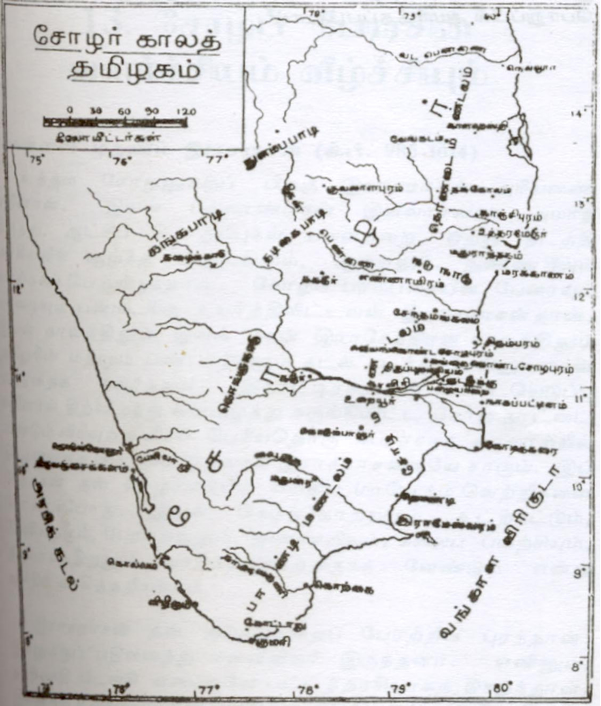

விசயாலய சோழன் (கி.பி. 850-871) தஞ்சையைக் கைப்பற்றித் தன்
வெற்றியின் சின்னமாக நிசும்பசூதினி என்ற கோயிலை எழுப்பினான். இவ்
வெற்றிக்கு முன்பு தஞ்சாவூர்ப் பகுதி முழுவதும் முத்தரையரின் ஆட்சிக்கு
உட்பட்டிருந்தது. முத்தரையர்கள் செந்தலை அல்லது நியமம் என்ற
இடத்திலிருந்து தஞ்சையை ஆண்டு வந்தனர். அவர்கள் அரசியல்
சூதாட்டத்தில் கைவந்தவர்கள். அவர்களுடைய அரசியல் சார்பு மாறிக்
கொண்டே இருந்தது. பல்லவருடனோ அன்றிப் பாண்டியருடனோ
துணைபூண்டு பிற மன்னரைப் பொருவார்கள். பல்லவருக்கும், வரகுண
பாண்டியனுக்குமிடையே விளைந்த போரில் முத்தரையர்கள் பாண்டியருடன்
இணைந்தனர். அப்போது விசயாலயன் பல்லவருக்குத் துணை நின்றான்.
போரில் விசயலாயன் வெற்றி கண்டான். தஞ்சாவூரைக் கைப்பற்றித் தன்
ஆட்சிக்கு ஆக்கத்தையும் விரிவையும் தேடிக்கொண்டான். உறையூருக்கு
அண்மையில் தங்கீழ் ஒரு குறுநில மன்னனாகத் திறை செலுத்தி
முடங்கிக்கிடந்த விசயாலயனின் கைகள் இவ் வெற்றியால் மிகவும்
வலுவடைந்துவிடும் என்று பல்லவர்கள் எதிர்பார்த்தவர்களல்லர். தமிழ்நாட்டு
வரலாற்றிலேயே ஈடிணையற்ற பெரும் புகழை ஈட்டிக்கொண்ட சோழப்
பேரரசர் பரம்பரை யொன்றைத் தான் தொடங்கி வைக்க விருந்ததை
விசயாலயனும் கனவுகூடக் கண்டிருக்கமாட்டான்.

விசயாலயன் வெற்றியின் காரணமாக முத்தரையரின் கை
ஒடுங்கிவிட்டது. முத்தரையரின் போர்த் துணையைப் பெற்றிருந்த வரகுண
பாண்டியன் மீண்டும் ஒருமுறை வடக்கே பல்லவரின்மேல் படையெடுத்து
வந்தான். பல்லவ மன்னனான அபராசிதன் தனக்குத் துணை நின்ற மன்னர்
அனைவரையும் ஒன்று கூட்டினான். அவனுக்குத் துணைபுரிய எழுந்தவர்களுள்
கங்க மன்னன் முதலாம் பிருதிவிபதியும் ஒருவன். பல்லவருக்கும்
கங்கருக்குமிடையே நீண்ட காலமாகவே நல்லுறவு நீடித்து வந்தது. இந்யடுத்து அவன் மகன் ஆதித்த சோழன் முடிசூட்டிக்கொண்டான்.
பாண்டியருக்கும் பல்லவருக்கும் திருப்புறம்பயம் என்னும் இடத்தில் பெரும்
போர் ஒன்று நிகழ்ந்தது. இப் போரில் ஆதித்த சோழன் பல்லவருடன்
இணைந்தான். போரில் அபராசிதன் வெற்றி கண்டான். அவனுடைய
துணைவன் பிருதிவிகங்கன் போர்க்களத்தில் புண்பட்டு மாண்டான் ;
வரகுணன் தோல்வியுற்றான். அபராசிதன், ஆதித்தன் தனக்குப் புரிந்த
பேருதவியைப் பாராட்டினான். விசயாலயன் முத்தரையரிடமிருந்து கைப்பற்றித்
தந்த நாட்டுடன் தானும் ஆதித்தனுக்குச் சில ஊர்களைப் பரிசாக
வழங்கினான்.

முதலாம் ஆதித்தன் (கி.பி. 871-907) அரசியல் ஆற்றல் மிக்கவன் ;
போர்த்திறன் வாய்ந்தவன். சோழநாட்டுக்கு விரிவு தேடவேண்டும் என்ற சீரிய
நோக்கங் கொண்டவன். தன் தந்தை தனக்கு மீட்டுக் கொடுத்த சோழ
நாட்டாட்சியை வலுவான அடிப்படையின்மேல் நிலைநாட்ட முயன்றான்.
அன்பில் செப்பேடுகளில் இவனைப்பற்றிய குறிப்புகள் கிடைக்கின்றன.
சயாத்திரி மலைகளிலிருந்து கீழைக் கடற்கரை வரையில் காவிரியின்
இருமருங்கிலும் சிவபெருமானுக்காகக் கற்றளிகள் பல எடுப்பித்தான். சோழ
நாட்டின் பெரும்பகுதி பல்லவரின் ஆட்சியின்கீழ் இருந்துவந்ததைக் கண்டு
ஆதித்தன் மனம் பொறாதவனாய் அதை மீட்கும் முயற்சிகளில் ஈடுபட்டான்.
பல்லவருடன் போர் தொடுத்தான். போரில் மாபெரும் வெற்றியுங் கண்டான்.
உயர்ந்ததொரு யானையின்மேல் அமர்ந்து போர் செய்து கொண்டிருந்த
அபராசித பல்லவனை ஆதித்தன் வாளால் ஒரே வீச்சில் கொன்றதாகக்
கன்னியாகுமரிக் கல்வெட்டு ஒன்று கூறுகின்றது. பல்லவ அரசு கவிழ்ந்தது.
பல்லவரின் ஆட்சிக்கு உட்பட்டிருந்த தொண்டை மண்டலத்தைக் கைப்பற்றி
ஆதித்தன் சோழ நாட்டுடன் இணைத்துக்கொண்டான். சோழ நாட்டெல்லை
விரிவடைந்து வடக்கே இராஷ்டிரகூடரின் ஆட்சி வரம்பை எட்டி நின்றது
(கி.பி. 890).

    ஆதித்தன் கண்ட வெற்றிகட்கெல்லாம் அவனுக்குக் கங்கர்கள் துணை
நின்றனர். ஆதித்தன் ‘இராசகேசரி’ என்ற விருது ஒன்றை ஏற்றான். பல்லவ
இளவரசி ஒருத்தி ஆதித்தனுக்கு மண முடிக்கப் பெற்றாள். இராஷ்டிரகூட
மன்னன் இரண்டாம் கிருஷ்ணன் என்கிற வல்லவரையன் மகள் இளங்கோன்
பிச்சி என்பவளை ஆதித்தன் தன் பட்டத்தரசியாக ஏற்றுக்கொண்டான்.

கொங்கு நாட்டில் ஆதித்தனின் கல்வெட்டுகள் கிடைக்கின்றன.
அவற்றைக் கொண்டு கொங்கு தேசத்தையும் அவன் வென்று தன்
ஆட்சியின்கீழ் இணைத்துக்கொண்டான் என்று ஊகித்தறியலாம். இவன்
தழைக்காடு என்ற ஊரைக் கைப்பற்றினான் என்று ‘கொங்கு தேச இராசாக்கள்’
என்னும் நூல் குறிப்பிடுகின்றது. ஆதித்தன் கொங்கு நாட்டிலிருந்து
கைப்பற்றிக் கொணர்ந்த பொன்னைக் கொண்டு தில்லையம்பலத்துக்குக் கூரை
வேய்ந்தான் என்று நம்பியாண்டார் நம்பியும் கூறுகின்றார்.  கங்க மன்னனான
இரண்டாம் பிருதிவிபதி ஆதித்தனுக்குக் கீழ்ப்பட்ட மன்னனாகவே
ஆட்சிபுரிந்து வந்தானாகையால் மேலைக் கங்கரிடமிருந்தே ஆதித்தன் தன்
நாட்டைக் கைப்பற்றியிருக்க வேண்டும்.

ஆதித்தன் சேர மன்னன் தாணுரவியுடன் நல்ல நட்புறவு
கொண்டிருந்தான். விக்கியண்ணன் என்ற படைத் தலைவன் ஒருவனுக்கு
இவ்விரு அரசரும் ‘தவிசு, சாமரை, சிவிகை, கோயில், போனகம், காளம்,
ஆண் யானை’ ஆகிய விருதுகளையும் ‘செம்பியன் தமிழவேள்’ என்ற
பட்டப்பெயரையும் வழங்கியுள்ளனர். இவ் வீரன் தாணுரவியின் படைத்
தலைவனாக அமர்ந்திருந்து சோழனுடைய கொங்குநாட்டுப் போர்களில் அம்
மன்னனுக்குப் படைத்துணை வழங்கியுள்ளான்.

காளத்தியை அடுத்துள்ள தொண்டைமான் நாடு என்ற இடத்தில்
ஆதித்தன் இம் மண்ணுலகை நீத்தான். அவனுக்குப் பராந்தகன் என்றும்,
கன்னரதேவன் என்றும் இரு மக்கள் இருந்தனர். கன்னரதேவன் இளங்கோன்
பிச்சி வயிற்று மகன். ஆதித்தனுக்குப் பிறகு முடிசூட்டிக் கொண்ட பராந்தகன்
தன் தந்தையின் சமாதியின்மேல் ‘கோதண்ட ராமேச்சுரம்’ என்ற பெயருடைய
கோயிலை எழுப்பினான். ஆதித்தனுடைய காலத்திலிருந்தே சோழப்
பரம்பரையானது சைவ சமயத்தில் ஈடுபாடு கொண்ட பரம்பரையாகவே
தொடங்கிற்று. சோழர்கள் சூரிய குலத்து வந்தவர்கள் என்றும்,
விசயாலயனுக்கு முன்பு இக் குலத்தினர் பதினைவர் அரசாண்டனர் என்றும்
அன்பில் செப்பேடுகள் கூறுகின்றன. அப் பதினைவருள் கரிகாலன், கிள்ளி
கோச்செங்கணான் ஆகியோர்களின் பெயர்களும் சேர்ந்துள்ளன.

பராந்தகன் (கி.பி. 907-955)

ஆதித்தன் மிகச் சிறந்த வீரர்களுள் ஒருவனாகத் திகழ்ந்து சோணாட்டு
அரசு கட்டிலை அணிசெய்து வந்தவன். திருப்புறம்பயம் போர் நிகழ்ந்து
இருபத்தைந்து ஆண்டு கால அளவில் சோழ அரசு வியக்கத்தக்க அளவு
விரிவடைந்துவிட்டது. இப்போரில் தோல்வியுற்ற வரகுண பாண்டியன் போர்
முடிவுற்ற வுடனே தன் உலக வாழ்வையும் நீத்தான். அவனையடுத்து அவன்
மகனான ஸ்ரீபராந்தக வீரநாராயணன் பட்டத்துக்கு வந்தான். பாண்டிய
நாட்டில் விளைந்த உள்நாட்டுக் கலகங்களின் காரணமாக அவனும் தன்
ஆற்றலை இழந்துகொண்டிருந்தான்.

ஆதித்தனையடுத்து அவன் மகன் முதலாம் பராந்தகன் அரியணை
ஏறினான். அப்போது சோழ நாட்டின் வடவெல்லை காளத்தி வரையிலும்,
தெற்கில் காவிரி வரையிலும் விரிவடைந்திருந்தது. மைசூர்ப் பீடபூமியும்,
கேரளக் கடற்கரையும் சோழ அரசுக்குப் புறம்பாக நின்றன. பராந்தகனின்
ஆட்சி நாற்பத்தெட்டு ஆண்டுக் காலம் நீடித்தது. பராந்தகன் பாண்டியரைத்
தனக்குப் பணிய வைத்துத் தன் ஆட்சியைத் தெற்கில் கன்னியாகுமரி
வரையில் விரிவுறச் செய்தான். தன்னுடைய மூன்றாம் ஆட்சி யாண்டுக்குள்
பராந்தகன் பாண்டி நாட்டின்மேல் படையெடுப்பு ஒன்றை மேற்கொண்டான்.
அவனை எதிர்த்து நிற்கும் வலியிழந்து இப் பாண்டியன் தன் நாட்டைக்
கைவிட்டு முதலில் இலங்கைக்கு ஓடினான் ; பிறகு அங்கிருந்து கேரளத்துக்கு
ஓடினான். சின்னமனூர், உதயேந்திரம் செப்பேடுகளிலிருந்து இப் பாண்டிய
மன்னனின் பெயர் இராசசிம்மன் என்று அறிகின்றோம். இலங்கை வேந்தன்
ஐந்தாம் காசிபன் (கி.பி. 913-923) தனக்குப் படைத்துணை அனுப்பியும்,
பாண்டியன் வெற்றி காணத் தவறினான். அவன் வெள்ளூர் என்ற இடத்தில்
சோழனிடம் படுதோல்வியுற்றான் (கி.பி. 915). இம் மாபெரும் வெற்றிக்குப்
பிறகு பராந்தக சோழனின் செல்வாக்கானது மேலும் ஓங்கி வளரலாயிற்று.
அவன் பாண்டி நாட்டின் அரசனாகவும் மதுரையில் முடிசூட்டிக் கொள்ள
அவாவினான். ஆனால், பாண்டிய நாட்டு மணிமுடியும் செங்கோலும்
மதுரையில் இல்லை என்று அறிந்த பராந்தகன் பெரிதும் ஏமாற்றமடைந்தான்.
பாண்டியன் இராசசிம்மன் நாட்டைத் துறந்து இலங்கைக்கு ஓடியவன்,
அவற்றை அங்கேயே கைவிட்டுக் கேரளம் போயிருந்தான். அம்
மணிமுடியையும், செங்கோலையும் தனக்கு உடனே அனுப்பி வைக்கும்படி
பராந்தகன் அந் நாட்டு மன்னன் நான்காம் உதயன்
(கி.பி. 945-53) என்பானுக்குத் தூது ஒன்று அனுப்பினான். அக் கட்டளைக்கு
உதயன் மறுக்கவே பராந்தகன் அவன்மேல் படையெடுத்தான். அவனுடைய
படைபலத்துக்கு அஞ்சி உதயன் ரோகணம் என்ற பகுதிக்கு
ஓடிப்போய்விட்டான் ; போகும் போது பாண்டி நாட்டு மணிமுடியையும்,
செங்கோலையும் உடன் கொண்டு போனான். பராந்தகனின் நோக்கம்
நிறைவேறாமற் போய்விட்டது. அவனும் ஏமாற்றத்துடன் தன் நாடு
திரும்பினான்.

கேரள மன்னனும், கீழ்ப்பழுவூரைச் சேர்ந்த பழுவேட்டரையரும்,
கொடும்பாளூர் வேளிர்களும் பராந்தகனுக்குத் துணைபுரிந்தார்கள்.
பராந்தகனின் மக்களுள் ஒருவனான அருள்கேசரி என்பான் கொடும்பாளூர்ப்
பரம்பரையைச் சார்ந்த தென்னவன் இளங்கோ வேளான் என்பவனின் மகள்
பூபதி ஆதிச்ச பிடாரியை மணம் புரிந்துகொண்டான். கங்க மன்னன்
இரண்டாம் பிருதிவிபதிக்குப் பராந்தகன், ‘வாணாதிராசன்’ என்ற
பட்டமொன்றை வழங்கிப் பாராட்டினான். வைதும்பரை வென்று சோழ
மன்னன் வெற்றிவாகை சூடினான்.

பராந்தகனை அரியணையினின்றும் இறக்கித் தன் மகள் வயிற்றுப்
பிறந்த கன்னரதேவனைச் சோழ நாட்டு மன்னனாக முடிசூட்டுவிக்கும் சூழ்ச்சி
ஒன்றில் இராஷ்டிரகூடன் இரண்டாம் கிருஷ்ணன் ஈடுபடலானான். தனக்குத்
திறை செலுத்தியவர்களான வாணகோவரையரின் துணைகொண்டு அவன்
சோழ நாட்டின்மீது போர் தொடுத்தான். கங்க மன்னன் இரண்டாம்
பிருதிவிபதியின் துணையைப் பெற்றுப் பராந்தகன் தன் படை வலிமையைப்
பெருக்கிக்கொண்டான். பராந்தகனுக்குக் கங்க மன்னன் இரண்டாம்
பிருதிவிபதி படைத்துணை நல்கினான். சோழரின் படைகளும்
இராஷ்டிரகூடரின் படைகளும் திருவல்லத்தில் மோதிக்கொண்டன (கி.பி. 910-
11). கிருஷ்ணனும் அவனுடைய போர்த் துணைவரும் படுதோல்வி யடைந்தனர்.
பராந்தகன் வீரவெற்றி கண்டான் ; ‘வீரசோழன்’ என்ற விருது ஒன்றையும்
ஏற்றுக்கொண்டான்.

வாணகோவர்கள் மிகப் பழையதொரு பரம்பரையில் வந்தவர்கள்.
இவர்கள் திருக்காளத்திக்கு வடக்கே அரசாண்டு வந்தனர். வாதாபி
சாளுக்கர்களின் ஆதிக்கம் ஓங்கி வரவே வாணகோவர்களின் அரசியற்
செல்வாக்கும், ஆட்சி எல்லைகளும் சுருங்கிவந்தன. பராந்தகன் காலத்தில்
இவர்களுடைய ஆட்சி வரம்பானது பாலாற்றுக்கு வடக்கிலே புங்கனூருக்கும்
திருக்காளத்திக்கும் இடையில் பரவியிருந்த நிலப்பகுதியில் ஒடுங்கி நின்றது. இவர்களுடைய
நாட்டுக்குப் பெரும்பாணப்பாடி என்று பெயர். வாணகோவரின் ஆட்சியானது
ஏறக்குறைய இருநூறு ஆண்டுகள் நிலைத்து நின்றது. இப் பரம்பரையில்
இறுதியாக அரியணை ஏறியவன் மூன்றாம் விக்கிரமாதித்தன் ஆவான். இவன்
இராஷ்டிரகூடமன்னன் கிருஷ்ணனுடன் நெருங்கிய நட்புறவு பூண்டிருந்தான்.

கங்க மன்னன் இரண்டாம் பிருதிவிபதி பராந்தகனிடம் வாணாதிராசன்
என்ற வீர விருதைப் பெற்றுப் பிறகு சிறிது காலம் வாணர்களிடம் (Banas)
திறை பெற்று வந்தான். இரண்டாம் விக்கிரமாதித்தனும், மூன்றாம்
விசயாதித்தனுமான இரு வாண மன்னர்கள் பெரும்பாணப்பாடியைப்
பராந்தகனுக்குப் பறிகொடுத்துவிட்டு இராஷ்டிரகூட மன்னன் மூன்றாம்
கிருஷ்ணனிடம் அடைக்கலம் புகுந்தார்கள்.

பராந்தக சோழன் வாணகோவரின்மேல் போர் தொடுக்க எழுந்தபோது
அவனுக்கு வைதும்பர் என்ற தெலுங்கு மன்னரின் எதிர்ப்பை முதலில்
முறியடிக்க வேண்டிய நிலை ஏற்பட்டது. வைதும்பர்கள் என்பவர்கள்
ரேநாண்டு என்ற நாட்டை ஆண்டு வந்தவர்கள் ; வாணகோவரின்
துணைவர்கள், பெரும்பாணப்பாடியின்மேல் பராந்தகன் படையெடுத்தபோது
சந்தயன் திருவயன் என்பவனோ அன்றி அவனுக்கு முற்பட்டு இருந்த
ஒருவனோ மன்னனாக ஆட்சிபுரிந்து வந்திருக்க வேண்டும். சோழரின் கடும்
தாக்குதலைத் தாங்கமுடியாதவனாய் வைதும்பனும் இராஷ்டிரகூடனிடம் சரண்
புகுந்தான்.

பராந்தக சோழனின் பேரரசு வெகுவிரைவில் வளர்ந்து வந்து ஐம்பது
ஆண்டுக்கால அளவில் மிகவும் விரிவடைந்து விட்டது. அது வெகு துரிதமாக
வளர்ந்து வந்ததால் நாடு முழுவதிலும் வலிமையானதோர் அடிப்படையில்
ஆங்காங்கு அரசாங்கத்தை நிறுவுவதற்குப் பராந்தகனுக்குக் காலமும்
வாய்ப்பும் போதவில்லை. அவனுடைய வெம்போர்த் தாக்குதல்களைத்
தாங்கவியலாதவராகி நாடு கடந்தோடிய மன்னர்கள் அவன்மீது பழிவாங்கக்
காலங்கருதிவந்தனர். பராந்தகனின் போர் ஆற்றலின் பெருக்கமானது
இராஷ்டிரகூடர்கள், கீழைச் சளுக்கியர்கள் ஆகியவர்களுடைய நெஞ்சில்
அச்சத்தையும் வஞ்சத்தையும் மூட்டிவிட்டது. வாணரும் வைதும்பரும் தனக்கு
அஞ்சி ஓடி ஒளிந்து வாழ்ந்து வந்ததையும், அதனால் ஏற்படக் கூடிய
விளைவுகளையும் பராந்தகன் நன்கு அறிந்திருந்தான்.

மேலைக் கங்கர் வேறு அவனுக்குத் தொல்லை கொடுக்க முனைந்தனர்.
அவர்களுடைய மன்னனான பெருமானடிகளும் சோழ நாட்டு எல்லைக்குள்
புகுந்து ஆனிரைகளைக் கவர்ந்தோடத் தொடங்கினான். வடஆர்க்காடு
மாவட்டத்தில் நிகழ்ந்த கங்க மன்னனின் பசுக் கவரும் படையெடுப்பு
ஒன்றின்போது சோழ மறவன் ஒருவன் அவனை எதிர்த்துப் போராடிப்
போர்க்களத்தில் புண்பட்டிருந்தான். அவனுடைய தொண்டின் சிறப்பையும்,
வீரத்தையும் பாராட்டிய பராந்தகன் அவனுக்கு வீரக்கல் ஒன்று
எடுப்பித்தான். சோழ நாட்டின்மேல் சுழன்று, புரண்டு வீசத் தொடங்கிய
பகைப்புயலைப் பராந்தகன் நன்கு அறிந்துகொண்டு முன்னராகவே
தற்பாதுகாப்பு நடவடிக்கைகளை மேற்கொள்ளலானான். திருமுனைப்பாடி
நாட்டில் அவன் தன் மூத்தமகன் இராசாதித்தனை ஒரு பெரும் படையின்
தலைமையில் நிலைப்படுத்தியிருந்தான். அப் படையில் யானையணிகளும்,
குதிரையணிகளும் அடங்கியிருந்தன. இராசாதித்தனின் தண்டுகள்
திருமுனைப்பாடி நாட்டில் சுந்தரமூர்த்தி நாயனாரின் பிறப்பிடமாகிய
திருநாவலூரில் பல ஆண்டுகள் நிறுத்தப்பட்டிருந்தன. அவ்வூர் கி.பி. 1140
வரையில் இராசாதித்தபுரம் என்னும் பெயரிலேயே விளங்கி வந்தது. பல
ஆண்டுகளாகத் திரண்டு உருவாகிக்கொண்ட பகைப்புயல் இறுதியாகச் சோழ
நாட்டின்மேல் தாக்கிப் புடைக்கத் தொடங்கிற்று. பகைப் படைகள்
இராசாதித்தனைத் தக்கோலம் என்னும் இடத்தில் எதிர்த்து நின்றன. அங்கப்
பெரும் போர் விளைந்தது (கி.பி. 949). தக்கோலம் என்னும் ஊர் வட
ஆர்க்காடு மாவட்டத்தில் அரக்கோணத்துக்குச் சுமார் பத்துக் கிலோமீட்டர்
தொலைவில் அமைந்துள்ளது. தக்கோலத்துக்குத் ‘திருவூறல்’ என்றொரு பழம்
பெயர் உண்டு. இவ்வூர் உமாபதி ஈசுவரர் கோயிலின் நந்திச் சிலையொன்றின்
வாயிலிருந்து எப்பொழுதும் தண்ணீர் வடிந்துகொண்டே இருக்கும். மிக
அண்மையிற்றான் இவ்வூற்று வறண்டுவிட்டது. எப்போதும் தண்ணீர்
ஊறிக்கொண்டே இருந்ததால் இவ்வூர் திருவூறல் என்னும் பெயரெய்திற்று.

தக்கோலத்துப் போரில் இரு படைகளின் கைகலப்பும் மிகக் கடுமையாய்
இருந்தது. போர் மும்முரமாக நடைபெற்றுக் கொண்டிருந்தபோது,
இராஷ்டிரகூடப் படைத்தலைவர்களுள் பூதுகன் என்பான் ஒருவன்
இராசாதித்தன் அமர்ந்திருந்த யானையின்மேல் துள்ளியேறி இராசாதித்தனைக்
கத்தியால் குத்திக் கொன்றான். போரின் முடிவில் வெற்றிவாகை இராஷ்டிரகூடனுக்குக்
கிடைத்தது. அவனும் தன் படைத் தலைவனான பூதுகன் தனக்காற்றிய அரிய
தொண்டுக்காகவும் அவன் துணிவைப் பாராட்டியும் அவனுக்கு வனவாசி
12,000, வெள்வோணம்-300 ஆகிய நாடுகளை வழங்கித் தன் நன்றியைத்
தெரிவித்துக்கொண்டான். தக்கோலத்துப் போரில் இராசாதித்தன்
‘வீரசொர்க்கம்’ அடைந்ததாகத் திருவாலங்காட்டுச் செப்பேடும், லீடன்
செப்பேடும் கூறுகின்றன. சோழ நாட்டின் பெரும்பகுதிகளை இராஷ்டிரகூடரும்
அவர்களுடைய போர்த் துணைவர்களும் தமக்குள் பங்கு
போட்டுக்கொண்டனர்.

தக்கோலத்துப் போர்முனையில் உயிரிழந்த இராசாதித்தனின்
அன்னையின் பெயர் கோக்கிழான் அடிகள். பராந்தகனின் மற்றொரு மனைவி
கேரளத்து அரசிளங்குமரியாவாள். இவள் மகன் அரிஞ்சயன். இவளுடைய
செல்வாக்கின் துணை கொண்டு சேர நாட்டவர் பெருந்தொகையில்
தமிழகத்தில் ஆங்காங்குக் குடியேறினர். பலர் அரண்மனையில் பணியாளராக
அமர்ந்தனர். சேர நாட்டைச் சேர்ந்தவனான வெள்ளன் குமரன் என்பான்
ஒருவன் இராசாதித்தனுக்குப் படைத்தலைவனாகப் பணியாற்றிக்
கொண்டிருந்தான். இவன் திருநாவலூருக்கு அண்மையில் கிராமம் என்ற
இடத்தில் கோயில் ஒன்று எழுப்பினான். இவனே பிறகு துறவுபூண்டு
திருவொற்றியூரில் மடம் ஒன்று எழுப்பிச் சதுரானன பண்டிதர் என்ற தீட்சைப்
பெயரில் அம் மடத்தின் தலைவனானான். இவனைத் தொடர்ந்து சேர நாட்டுக்
குடிகள் பலர் கோயில்களுக்குச் சிறு சிறு நிவந்தங்கள் அளித்து வந்தனர்.
இராசாதித்தனைத் தவிர்த்துப் பராந்தகனுக்கு ஆண் மக்கள் வேறு நால்வரும்,
பெண் மக்கள் இருவரும் உண்டு. ஆண் மக்கள் கண்டராதித்தன்,
அரிகுலகேசரி, உத்தமசீலி, அரிஞ்சயன் ஆவர். பெண் மக்கள் வீரமாதேவியும்
அநுபமாவும் ஆவர். வீரமாதேவி கோவிந்த வல்லவராயருக்கும், அநுபமா
கொடும்பாளூர்க் குறுநில மன்னன் ஒருவனுக்கும் வாழ்க்கைப்பட்டனர்.

முதலாம் பராந்தகன் கி.பி. 955 ஆண்டுவரையில் உயிர்
வாழ்ந்திருந்ததாகக் கல்வெட்டுக் குறிப்புகளால் அறிகின்றோம். இவன் தன்
ஆட்சிக் காலத்தில் மக்களுக்கு ஆற்றிய நன்மைகள் பல. ஊராட்சி முறையைத்
திருத்தியமைத்து, அதனுடைய நடைமுறை விதிகளையும் அறுதியிட்டான்
என்று உத்தர மேரூர்க் கல்வெட்டு ஒன்று குறிப்பிடுகின்றது. இவன் பாசனக் கால்வாய்கள்
பல வெட்டி உழவின் வளர்ச்சியைத் தூண்டி விட்டான். இம் மன்னன்
இரணியகருப்பம், துலாபாரம் பல புரிந்தான். பிராமணருக்குப் பல
பிரமதேயங்கள் வழங்கினான். தில்லையம்பலத்துக்குப் பொன் வேய்ந்தான்.
தன் தந்தை ஆதித்தனைப் போலவே பராந்தகனும் சிவபெருமானுக்கெனப் பல
கோயில்களை எழுப்பினான். பல துறைகளிலும் இவனுடைய செங்கோல்
சிறப்புற்று விளங்கிற்று.

பராந்தகனுக்குப் பிறகு முப்பது ஆண்டுகள் வரை, அதாவது முதலாம்
இராசராசன் அரசுகட்டில் ஏறியவரையிலும் சோழ அரசில் ஒரு பெரும்
குழப்பம் ஏற்பட்டது. இக் காலத்தில் நாட்டப்பெற்ற கல்வெட்டுகள் பலவும்,
பொறிக்கப்பட்ட அன்பில் செப்பேடுகளும் வரலாற்று நிகழ்ச்சிகளை
இணைத்துச் சோழ மன்னரின் ஆட்சி வரிசையை அறுதியிடத்
துணைசெய்கின்றன.

பராந்தகனையடுத்துக் கண்டராதித்தன் பட்டத்துக்கு வந்தான். தமிழகத்து
வரலாற்றில் புகழொளி வீசி விளங்கும் செம்பியன் மாதேவியே இவன்
பட்டத்தரசியாவள். இவள் கட்டிய கோயில்கள் பல. இவளும் இவள்
கணவனும் சேர்ந்து சைவ சமய வளர்ச்சிக்காகப் பல அரிய தொண்டுகள்
புரிந்துள்ளனர். கண்டராதித்தன் பாடிய தோத்திரப் பாடல்கள் சில சைவத்
திருமுறைகள் பன்னிரண்டனுள் ஒன்பதாந் திருமுறையில் வைக்கப்பட்டுள்ளன.
இச் சோழ மன்னனின் வாணாள் இறுதியில் (கி.பி. 957) சோழப் பேரரசானது
மிகவும் சிறியதொரு நாடாகச் சுருங்கி வந்துவிட்டது. அப்போது தொண்டை
மண்டலம் முழுவதும் இராஷ்டிரகூடன் மூன்றாம் கிருஷ்ணனுக்கு
உட்பட்டிருந்தது.

கண்டராதித்தனை யடுத்து அவனுடைய இளவலான அரிஞ்சயன்
அரியணை ஏறினான். அவன் இரண்டாண்டுகள் அரசாண்டான். அவனுக்குப்
பிறகு அவன் மகன் இரண்டாம் பராந்தகன் என்னும் சுந்தர சோழன்
முடிசூட்டிக் கொண்டான் (கி.பி. 957). இவன் வைதும்ப இளவரசி கல்யாணியின்
மகன். இவனுடைய ஆட்சி கி.பி. 973 வரை நீடித்தது. தான் ஆட்சி
பொறுப்புகளை ஏற்றுக்கொண்டவுடனே இவன் தன் இரண்டாம் மகனான
இரண்டாம் ஆதித்தனுக்கு இளவரசு பட்டஞ்சூட்டினான். இவன் காலத்தில்
தெற்கே பாண்டி நாட்டில் வீரபாண்டியன் ஆட்சி புரிந்து வந்தான். சிங்கள
மன்னனான நான்காம் மகிந்தன் இவனுடன் நட்புறவு கொண்டிருந்தான்.
ஒருமுறை சோழன் கண்டராதித்தனை இப் பாண்டியன் போரில் வென்று வீரமுழக்கம் செய்து கொண்டிருந்தான்.
அவனை ஒறுக்கும் நோக்கத்துடன் சுந்தர சோழன் பாண்டி நாட்டின்மேல்
படையெடுத்துச் சென்றான். சோழருக்கும் பாண்டியருக்குமிடையே இரு பெரும்
போர்கள் நிகழ்ந்தன. சேவூரில் நடைபெற்ற கடும்போரில் பாண்டியனின்
யானைப் படைகள் சிதறுண்டு அழிந்து போயின. நூற்றுக்கணக்கான
யானைகள் வெட்டுண்டு மாய்ந்தன. அவற்றின் குருதியானது போர்க்களத்தில்
ஆறாகப் பாய்ந்தது. இளவரசன் கரிகாலன் என்னும் இரண்டாம் ஆதித்தன்
ஆண்டில் இளைஞன் எனினும், தானும் போர்க்கோலம் பூண்டு மதயானையை
இளஞ்சிங்கம் பொருதலைப் போலப் பாண்டிய மன்னனுடன் நேருக்கு
நேராகக் கடும்போர் புரிந்தான். அவன் தாக்குதலைத் தாங்கக் கூடாமல்
பாண்டியன் துவண்டான். போர்க்களத்தினின்றும் புறமுதுகிட்டோடிச் சயாத்திரி
மலைமுழை யொன்றில் ஒளிந்தான். ஆதித்தனின் சிறந்த வீரத்தைப்
பாராட்டிச் சோழன் அவனுக்குப் ‘பாண்டியனின் முடிகொண்ட சோழன்’
என்றொரு விருதை வழங்கினான். சோழரின் படைகள் தாம் பெற்ற
வெற்றியைத் தொடர்ந்து பாண்டி நாட்டுக்குள்ளும் நுழைந்தன. இவற்றின்
தலைவர்களுள் கொடும்பாளூர்க் குறுநில மன்னன் பராந்தகன் சிறிய வேளான்
என்பவனும் ஒருவன். பாண்டி நாட்டுப் படைகள் முறியடிக்கப்பட்டன. அவை
மட்டுமன்றிப் பாண்டியருக்குத் துணை புரிய வந்த சிங்களப் படைகளும்
சிதறுண்டு சிங்களத்தை நோக்கித் திரும்பி யோடின. அவற்றைத் துரத்திச்
சென்ற சிறிய வேளான் இலங்கைத் தீவின் மேலும் படையெடுத்துச் சென்றான்.
ஆனால், அங்கு அவன் வெற்றி கண்டும் போரில் புண்பட்டு வீர மரணம்
எய்தினான் (கி.பி. 965).

இரண்டாம் ஆதித்தனேயன்றிப் பார்த்திவேந்திர வர்மன் என்ற
பெயருள்ள சோழ மன்னன் ஒருவனும் வீரபாண்டியனை வென்று
முடிகொண்டதாகத் தொண்டைமண்டலத்துக் கல்வெட்டுகள் சில
தெரிவிக்கின்றன. இவனுக்குப் ‘பரகேசரி’ என்றும், ‘கோவிந்தராசமாராயர்’
என்றும் விருதுகள் வழங்கியதாகக் கல்வெட்டுச் செய்திகள் கிடைத்துள்ளன.
இவனுடைய அரசியருக்கு ‘உடையார் தேவியார் வில்லவன் மகாதேவியார்’,
‘பெருமானடிகள் தேவியார்’, ‘தன்மப் பொன்னாராகிய திரைலோக்கிய
மகாதேவியார்’ என்ற பட்டப் பெயர்கள் வழங்கி வந்ததாகத் தெரிகின்றன.
இவற்றை நோக்கின் பார்த்திவேந்திர ஆதித்தவர்மனும் இரண்டாம் பரகேசரி ஆதித்தனும் வெவ்வேறானவர்
அல்லர்; ஒருவரே என்று புலப்படுகின்றது.

வீரபாண்டியனை எதிர்த்துப் போரிட்ட மற்றொருவன் கொடும்பாளூர்
பூதிவிக்கிரமகேசரி என்பான். இவனுக்குக் கற்றளிபிராட்டி என்றும்,
வரகுணப்பெருமானார் என்றும் இரு மனைவியர் உண்டு.

சுந்தர சோழனின் ஆட்சி பலவகையிலும் சிறப்புற்றிருந்தது. அவன்
இராஷ்டிரகூடரிடமிருந்து சோழ நாட்டின் வடபகுதிகளை மீட்டுக்
கொள்ளுவதிலேயே நோக்கமாக இருந்து இறுதியில் அவர்களுடன் போரிட்டுத்
தொண்டைமண்டலத்தைத் தன் குடைக்கீழ் இணைத்துக் கொண்டான்.
காஞ்சிபுரத்தில் தன் பொன்மாளிகையில் அவன் உயிர் துறந்தான். அதனால்
அவனுக்குப் ‘பொன்மாளிகைத் துஞ்சிய தேவன்’ என்று ஒரு பெயர்
ஏற்பட்டது. அவனுடைய அரசியர் இருவருள் வான வன்மாதேவி என்பவள்
மலையமான் பரம்பரையில் வந்தவள். இந்திய வரலாற்றிலேயே ஈடிணையற்ற
சீரும் சிறப்பும் பெற்று ஓங்கிய முதலாம் இராசராச சோழனின் தாய் இவள்.
அவள் தன் கணவனுடன் உடன்கட்டையேறி உயிர் துறந்தாள். அவள்
மகளான குந்தவை பிராட்டியார் தஞ்சைப் பெருவுடையார் கோயிலுள்
அவளுக்காகச் சிலை ஒன்று எடுப்பித்துள்ளாள். மற்றொருத்தி சேர நாட்டினள்.
இவள் கி.பி. 1001 வரையில் உயிர் வாழ்ந்திருந்தாள்.

வீரசோழியம் என்னும் இலக்கண நூலின் உரையாசிரியர் சுந்தர
சோழனுக்குப் புகழ் மாலைகள் சூட்டியுள்ளார். இம் மன்னனுக்கும்
தென்னாட்டுப் பௌத்த சங்கத்துக்கு மிடையில் தொடர்ந்து நட்புறவு வளர்ந்து
வந்திருந்ததாகத் தெரிகின்றது.

சுந்தரசோழனின் இறுதி நாள்கள் துன்பத்தில் தோய்வுற்றன. முதலாம்
பராந்தகனின் இரண்டாம் மகனுக்குப் பரகேசரி மதுராந்தகன் உத்தம சோழன்
என்றொரு மகன் இருந்தான். பராந்தகனின் மூன்றாம் மகனான அரிஞ்சயன்
கால்வழி வந்தவன் இரண்டாம் ஆதித்தன். எனவே, இயல்பாகத் தனக்குக்
கிடைக்க வேண்டிய அரசுரிமையை அவ்வாதித்தன் பறித்துக்கொண்டான்
என்று எண்ணி எண்ணி மனங் கருகினான் உத்தம சோழன். திடுமென ஒரு
நாள் ஆதித்த சோழன் கொலையுண்டு இறந்து விட்டான். தன் மகனின்
அகால மரணத்துக்கு மனமுடைந்தவனாய்ச்சுந்தரசோழனும் தொடர்ந்து விண்ணுலகெய்தினான். அவனை யடுத்து உத்தம
சோழன் அரசுகட்டில் ஏறினான். சோழனைக் கொலை செய்தவர்கள் இன்னார்
எனப் புலன்கண்டு பிடித்து அவர்களை ஒறுக்கும் முயற்சியை உத்தம சோழன்
தன் ஆட்சிக் காலம் முழுவதிலும் எடுக்கவே இல்லை. சோழன் என்பான்
ஒருவனும் அவன் தம்பியும் பாண்டியன் தலைகொண்ட கரிகாற் சோழனைக்
கொலை செய்தார்கள் என்றும் அக் குற்றத்துக்குத் தண்டனையாக
அவர்களுடைய உடைமைகளும், அவர்களுடைய சுற்றத்தாரின் உடைமைகளும்
பறிமுதல் செய்யப்பட்டனவென்றும, பிறகு விற்கப்பட்டனவென்றும் இராசகேசரி
வர்மன் (முதலாம் இராசராசன்) பேரில் வெளியான கல்வெட்டு (கி.பி. 988)
ஒன்று தெரிவிக்கின்றது. எனினும், இக் கொடுங் கொலைக் குற்றத்தில் உத்தம
சோழனுக்கும் பெரும் பங்கு உண்டு என்று வரலாறு வற்புறுத்துகின்றது.

பலவான கல்வெட்டுகளிலிருந்தும் செப்பேடுகளிலிருந்தும் உத்தம
சோழனின் ஆட்சியைப் பற்றிய குறிப்புகள் பல கிடைத்துள்ளன. அவன்
காலத்தில் வெளியிடப்பட்ட சோழ நாணயம் ஒன்றும் கண்டெடுக்கப்
பட்டுள்ளது. அதன்மேல் ‘உத்தம சோழன்’ என்னும் பெயர் கிரந்த
எழுத்துகளில் பொறிக்கப்பட்டுள்ளது.

சென்னைப் பொருட்காட்சி சாலையில் வைக்கப்பட்டுள்ள உத்தம
சோழனின் செப்பேடு ஒன்று (கி.பி. 984-5) அம் மன்னனைப் பற்றியும்,
அவனுடைய அரசிமார்களைப் பற்றியும், ஆட்சியைப் பற்றியும் பல
செய்திகளைத் தெரிவிக்கின்றது. அச் செப்பேட்டில் பொறிக்கப்பட்டுள்ள
எழுத்துகள் மிகவும் அழகாக விளங்குகின்றன. அம்பலவன் பழுவூர் நக்கன்
என்பான் ஒருவன், குவலாளத்தைச் (கோலாரை) சேர்ந்தவன். உத்தம
சோழனுக்குப் பெருந்தரத்துப் பணியாளனாகத் தொழில் புரிந்து வந்ததாகத்
திருச்சிராப்பள்ளிக் கல்வெட்டுகள் சில தெரிவிக்கின்றன. திருநாவுக்கரசரின்
பாடலைப்பெற்ற விசயமங்கலத்துக் கோயிலை இவன் கற்றளியாக
மாற்றியமைத்தான். இவன் மிகச் சிறந்த ஆட்சித் திறனும் இனிய
பண்பாடுகளும் வாய்ந்தவன் என அறிகின்றோம். முதலாம் இராசராசன்
காலத்திலேயே இவன் சோழர் பணியில் அமர்ந்திருந்தவன். இவனுடைய
திறமையைப் பாராட்டி உத்தமசோழன் இவனுக்கு ‘விக்கிரமசோழமாராயன்’என்ற விருது ஒன்றை வழங்கினான். இவனுக்கு இராசராசனே ‘மும்முடிச்
சோழன்’ என்றும், இராசராசப் பல்லவராயன்’ என்றும் விருதுப் பெயர்களைச்
சூட்டியிருந்தான்.

  

உத்தம சோழனுக்குப் பல மனைவியர் இருந்தனரெனக் கல்வெட்டுகள்
மூலம் அறிகின்றோம். அவர்களுள் உரத்தாயன் சொரப்பையார் என்பவள்
பட்டத்தரசியாக விளங்கினாள். அவள் கன்னட நாட்டு இளவரசி போலும்.
அவளுக்கு அக்கிரமகா தேவியார் என்றும் மூத்த நம்பிராட்டியார் என்றும்
வேறு பெயர்களும் உண்டு. இவையன்றி அவள் திரிபுவன மகாதேவியார் என்ற விருதுப் பெயர் ஒன்றையும் ஏற்றிருந்தாள். உத்தம சோழனின் அரசிகள்
அனைவருமே கோயில்களுக்கு நிவந்தங்கள் அளித்துள்ளனர். உத்தம
சோழனுக்கு மதுராந்தகன் கண்டராதித்தன் என்று ஒரு மகன் இருந்தான்.
இவன் பிற்பாடு முதலாம் இராசராசன் காலத்தில் மிகவும் உயர்ந்ததோர்
அரசாங்கப் பொறுப்பில் அமர்த்தப்பட்டான்.
